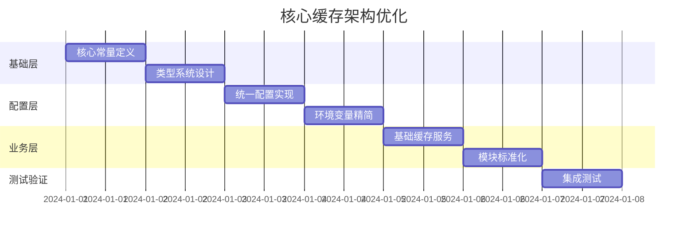

# 🚀 **核心缓存组件架构优化方案**

> **项目性质**: 全新项目，专注核心缓存架构
> **设计理念**: 简洁、高效、零重复
> **核心目标**: 解决配置混乱和常量重复问题

---

## **一、核心问题聚焦**

### **🎯 必须解决的核心问题**

| 问题 | 严重程度 | 实际情况 | 影响 |
|------|----------|----------|------|
| **重复常量定义** | P0 | 4个共享常量文件存在语义重复 | 维护困难，魔法数字 |
| **环境变量混乱** | P0 | **95个环境变量**分散在各模块 | 配置管理灾难 |
| **导入路径不一致** | P1 | 组件间导入路径混乱 | 依赖关系复杂 |
| **命名规范缺失** | P2 | 无统一命名约定 | 认知负担重 |

### **❌ 不在此次重构范围**
- ~~监控系统重构~~ （保持现状）
- ~~事件系统改造~~ （保持现状）
- ~~性能优化器~~ （保持现状）
- ~~日志系统重构~~ （保持现状）

---

## **二、精简架构设计**

### **🏗️ 三层架构**

```
src/core/05-caching/
├── 📁 foundation/                    # 基础层（Layer 0）
│   ├── constants/
│   │   ├── core-values.constants.ts      # 唯一数值定义源
│   │   └── cache-operations.constants.ts # 操作类型定义
│   ├── types/
│   │   ├── cache-config.types.ts         # 配置类型定义
│   │   └── cache-result.types.ts         # 结果类型定义
│   └── schemas/
│       └── env-validation.schema.ts      # 环境变量验证
├── 📁 config/                       # 配置层（Layer 1）
│   ├── unified-config.ts                 # 统一配置
│   └── environment.config.ts             # 环境变量管理
└── 📁 modules/                      # 业务层（Layer 2）
    ├── basic-cache/                      # 基础缓存服务
    ├── stream-cache/                     # 流缓存模块
    ├── data-mapper-cache/               # 数据映射缓存
    ├── symbol-mapper-cache/             # 符号映射缓存
    └── smart-cache/                     # 智能缓存编排
```

---

## **三、Layer 0: 基础层重设计**

### **3.1 核心数值常量（唯一源）**

```typescript
// src/core/05-caching/foundation/constants/core-values.constants.ts
/**
 * 核心缓存数值常量 - 整个系统的唯一数值定义源
 * 消除所有魔法数字，建立统一标准
 */
export const CORE_CACHE_VALUES = {
  // 🕐 时间单位（秒）- 业务层使用
  TIME_SECONDS: {
    INSTANT: 0,           // 立即过期
    MICRO: 5,            // 微缓存（实时数据）
    SHORT: 30,           // 短缓存（准实时）
    STANDARD: 300,       // 标准缓存（5分钟）
    LONG: 1800,          // 长缓存（30分钟）
    ARCHIVE: 3600,       // 归档缓存（1小时）
    DAILY: 86400,        // 日缓存
  },

  // ⏱️ 时间单位（毫秒）- 系统层使用
  TIME_MS: {
    ONE_SECOND: 1000,
    FIVE_SECONDS: 5000,
    TEN_SECONDS: 10000,
    THIRTY_SECONDS: 30000,
    ONE_MINUTE: 60000,
    FIVE_MINUTES: 300000,
    THIRTY_MINUTES: 1800000,
    ONE_HOUR: 3600000,
  },

  // 📊 批次处理标准
  BATCH_SIZE: {
    TINY: 5,            // 超小批次
    SMALL: 10,          // 小批次（默认）
    MEDIUM: 50,         // 中批次
    LARGE: 100,         // 大批次
    XLARGE: 200,        // 超大批次（流数据）
    BULK: 500,          // 批量处理
    MASSIVE: 1000,      // 大规模处理
  },

  // 🔧 系统限制
  LIMITS: {
    MAX_KEY_LENGTH: 250,           // Redis键长度限制
    MAX_VALUE_SIZE_KB: 1024,       // 最大值大小（1MB）
    MAX_CONCURRENT_OPS: 50,        // 最大并发操作
    MAX_RETRY_ATTEMPTS: 3,         // 最大重试次数
    DEFAULT_TIMEOUT_MS: 5000,      // 默认超时
    MIN_TTL_SECONDS: 1,            // 最小TTL
    MAX_TTL_SECONDS: 86400,        // 最大TTL（1天）
  },

  // 🎯 容量标准
  CAPACITY: {
    SMALL_CACHE_SIZE: 100,
    MEDIUM_CACHE_SIZE: 500,
    LARGE_CACHE_SIZE: 1000,
    XLARGE_CACHE_SIZE: 5000,
    MAX_CACHE_SIZE: 10000,
  },
} as const;

// 🏷️ 类型导出
export type CoreCacheValues = typeof CORE_CACHE_VALUES;
```

### **3.2 缓存操作定义**

```typescript
// src/core/05-caching/foundation/constants/cache-operations.constants.ts
export const CACHE_OPERATIONS = {
  // 基础操作
  BASIC: {
    GET: 'get',
    SET: 'set',
    DELETE: 'delete',
    EXISTS: 'exists',
    EXPIRE: 'expire',
  },

  // 批量操作
  BATCH: {
    MGET: 'mget',
    MSET: 'mset',
    MDEL: 'mdel',
    PIPELINE: 'pipeline',
  },

  // 模式操作
  PATTERN: {
    SCAN: 'scan',
    KEYS: 'keys',
    DEL_PATTERN: 'del_pattern',
    COUNT_PATTERN: 'count_pattern',
  },

  // 管理操作
  ADMIN: {
    CLEAR: 'clear',
    FLUSH: 'flush',
    INFO: 'info',
    STATS: 'stats',
  },
} as const;

// TTL策略定义
export const TTL_STRATEGIES = {
  REAL_TIME: {
    name: 'real_time',
    ttl: CORE_CACHE_VALUES.TIME_SECONDS.MICRO,
    description: '实时数据，极短TTL',
  },
  NEAR_REAL_TIME: {
    name: 'near_real_time',
    ttl: CORE_CACHE_VALUES.TIME_SECONDS.SHORT,
    description: '准实时数据，短TTL',
  },
  BATCH_QUERY: {
    name: 'batch_query',
    ttl: CORE_CACHE_VALUES.TIME_SECONDS.STANDARD,
    description: '批量查询，标准TTL',
  },
  LONG_TERM: {
    name: 'long_term',
    ttl: CORE_CACHE_VALUES.TIME_SECONDS.LONG,
    description: '长期数据，长TTL',
  },
  ARCHIVE: {
    name: 'archive',
    ttl: CORE_CACHE_VALUES.TIME_SECONDS.ARCHIVE,
    description: '归档数据，超长TTL',
  },
} as const;
```

### **3.3 类型定义**

```typescript
// src/core/05-caching/foundation/types/cache-config.types.ts
export interface CacheResult<T = any> {
  readonly success: boolean;
  readonly data?: T;
  readonly error?: Error;
  readonly responseTime: number;
}

export interface CacheOperation<T = any> {
  readonly key: string;
  readonly operation: keyof typeof CACHE_OPERATIONS.BASIC;
  readonly value?: T;
  readonly ttl?: number;
  readonly timestamp: number;
}

export interface CacheModuleConfig {
  readonly name: string;
  readonly defaultTtl: number;
  readonly batchSize: number;
  readonly maxSize: number;
  readonly enabled: boolean;
}
```

---

## **四、Layer 1: 配置层设计**

### **4.1 环境变量精简（95个 → 18个）**

```bash
# 🌍 基础配置（6个）
CACHE_ENABLED=true
CACHE_DEFAULT_TTL_SECONDS=300
CACHE_DEFAULT_BATCH_SIZE=100
CACHE_OPERATION_TIMEOUT_MS=5000
CACHE_MAX_CONCURRENT_OPERATIONS=50
CACHE_DEBUG_MODE=false

# 🔧 Redis配置（3个）
CACHE_REDIS_URL=redis://localhost:6379
CACHE_REDIS_MAX_CONNECTIONS=20
CACHE_REDIS_CONNECTION_TIMEOUT_MS=5000

# 🚀 性能配置（4个）
CACHE_COMPRESSION_ENABLED=false
CACHE_COMPRESSION_THRESHOLD_BYTES=1024
CACHE_MEMORY_CLEANUP_THRESHOLD=0.85
CACHE_GRACEFUL_SHUTDOWN_TIMEOUT_MS=30000

# 🎯 业务配置（5个）
CACHE_STREAM_HOT_CACHE_SIZE=1000
CACHE_SYMBOL_MAPPER_L1_SIZE=500
CACHE_DATA_MAPPER_RULE_CACHE_SIZE=200
CACHE_SMART_CACHE_ADAPTIVE_ENABLED=true
CACHE_MARKET_AWARE_STRATEGY_ENABLED=true
```

### **4.2 统一配置类**

```typescript
// src/core/05-caching/config/unified-config.ts
import { IsNumber, IsBoolean, IsString, Min, Max } from 'class-validator';
import { Type, Transform } from 'class-transformer';
import { CORE_CACHE_VALUES } from '../foundation/constants/core-values.constants';

export class CacheUnifiedConfig {
  // 🌍 基础配置
  @IsBoolean()
  @Transform(({ value }) => value === 'true')
  enabled: boolean = true;

  @IsNumber() @Min(CORE_CACHE_VALUES.LIMITS.MIN_TTL_SECONDS) @Max(CORE_CACHE_VALUES.LIMITS.MAX_TTL_SECONDS)
  @Type(() => Number)
  defaultTtlSeconds: number = CORE_CACHE_VALUES.TIME_SECONDS.STANDARD;

  @IsNumber() @Min(1) @Max(CORE_CACHE_VALUES.BATCH_SIZE.MASSIVE)
  @Type(() => Number)
  defaultBatchSize: number = CORE_CACHE_VALUES.BATCH_SIZE.LARGE;

  @IsNumber() @Min(100) @Max(60000)
  @Type(() => Number)
  operationTimeoutMs: number = CORE_CACHE_VALUES.LIMITS.DEFAULT_TIMEOUT_MS;

  @IsNumber() @Min(1) @Max(CORE_CACHE_VALUES.LIMITS.MAX_CONCURRENT_OPS)
  @Type(() => Number)
  maxConcurrentOperations: number = CORE_CACHE_VALUES.LIMITS.MAX_CONCURRENT_OPS;

  @IsBoolean()
  @Transform(({ value }) => value === 'true')
  debugMode: boolean = false;

  // 🔧 Redis配置
  @IsString()
  redisUrl: string = 'redis://localhost:6379';

  @IsNumber() @Min(1) @Max(100)
  @Type(() => Number)
  redisMaxConnections: number = 20;

  @IsNumber() @Min(1000) @Max(30000)
  @Type(() => Number)
  redisConnectionTimeoutMs: number = CORE_CACHE_VALUES.TIME_MS.FIVE_SECONDS;

  // 🚀 性能配置
  @IsBoolean()
  @Transform(({ value }) => value === 'true')
  compressionEnabled: boolean = false;

  @IsNumber() @Min(100) @Max(10240)
  @Type(() => Number)
  compressionThresholdBytes: number = 1024;

  @IsNumber() @Min(0.1) @Max(1.0)
  @Type(() => Number)
  memoryCleanupThreshold: number = 0.85;

  @IsNumber() @Min(5000) @Max(300000)
  @Type(() => Number)
  gracefulShutdownTimeoutMs: number = CORE_CACHE_VALUES.TIME_MS.THIRTY_SECONDS;

  // 🎯 业务配置
  @IsNumber() @Min(100) @Max(CORE_CACHE_VALUES.CAPACITY.MAX_CACHE_SIZE)
  @Type(() => Number)
  streamHotCacheSize: number = CORE_CACHE_VALUES.CAPACITY.LARGE_CACHE_SIZE;

  @IsNumber() @Min(100) @Max(CORE_CACHE_VALUES.CAPACITY.XLARGE_CACHE_SIZE)
  @Type(() => Number)
  symbolMapperL1Size: number = CORE_CACHE_VALUES.CAPACITY.MEDIUM_CACHE_SIZE;

  @IsNumber() @Min(50) @Max(CORE_CACHE_VALUES.CAPACITY.LARGE_CACHE_SIZE)
  @Type(() => Number)
  dataMapperRuleCacheSize: number = 200;

  @IsBoolean()
  @Transform(({ value }) => value === 'true')
  smartCacheAdaptiveEnabled: boolean = true;

  @IsBoolean()
  @Transform(({ value }) => value === 'true')
  marketAwareStrategyEnabled: boolean = true;
}

// 🏭 配置工厂函数
export function createCacheConfig(): CacheUnifiedConfig {
  const config = new CacheUnifiedConfig();

  // 基础配置
  config.enabled = process.env.CACHE_ENABLED !== 'false';
  config.defaultTtlSeconds = Number(process.env.CACHE_DEFAULT_TTL_SECONDS) || config.defaultTtlSeconds;
  config.defaultBatchSize = Number(process.env.CACHE_DEFAULT_BATCH_SIZE) || config.defaultBatchSize;
  config.operationTimeoutMs = Number(process.env.CACHE_OPERATION_TIMEOUT_MS) || config.operationTimeoutMs;
  config.maxConcurrentOperations = Number(process.env.CACHE_MAX_CONCURRENT_OPERATIONS) || config.maxConcurrentOperations;
  config.debugMode = process.env.CACHE_DEBUG_MODE === 'true';

  // Redis配置
  config.redisUrl = process.env.CACHE_REDIS_URL || config.redisUrl;
  config.redisMaxConnections = Number(process.env.CACHE_REDIS_MAX_CONNECTIONS) || config.redisMaxConnections;
  config.redisConnectionTimeoutMs = Number(process.env.CACHE_REDIS_CONNECTION_TIMEOUT_MS) || config.redisConnectionTimeoutMs;

  // 性能配置
  config.compressionEnabled = process.env.CACHE_COMPRESSION_ENABLED === 'true';
  config.compressionThresholdBytes = Number(process.env.CACHE_COMPRESSION_THRESHOLD_BYTES) || config.compressionThresholdBytes;
  config.memoryCleanupThreshold = Number(process.env.CACHE_MEMORY_CLEANUP_THRESHOLD) || config.memoryCleanupThreshold;
  config.gracefulShutdownTimeoutMs = Number(process.env.CACHE_GRACEFUL_SHUTDOWN_TIMEOUT_MS) || config.gracefulShutdownTimeoutMs;

  // 业务配置
  config.streamHotCacheSize = Number(process.env.CACHE_STREAM_HOT_CACHE_SIZE) || config.streamHotCacheSize;
  config.symbolMapperL1Size = Number(process.env.CACHE_SYMBOL_MAPPER_L1_SIZE) || config.symbolMapperL1Size;
  config.dataMapperRuleCacheSize = Number(process.env.CACHE_DATA_MAPPER_RULE_CACHE_SIZE) || config.dataMapperRuleCacheSize;
  config.smartCacheAdaptiveEnabled = process.env.CACHE_SMART_CACHE_ADAPTIVE_ENABLED !== 'false';
  config.marketAwareStrategyEnabled = process.env.CACHE_MARKET_AWARE_STRATEGY_ENABLED !== 'false';

  return config;
}
```

---

## **五、Layer 2: 业务层设计**

### **5.1 基础缓存服务（简化版）**

```typescript
// src/core/05-caching/modules/basic-cache/basic-cache.service.ts
import { Injectable } from '@nestjs/common';
import { Redis } from 'ioredis';
import { CacheResult, CacheOperation } from '../../foundation/types/cache-config.types';
import { CacheUnifiedConfig } from '../../config/unified-config';

/**
 * 基础缓存服务 - 纯缓存逻辑，无监控无事件
 * 专注于核心缓存操作的可靠实现
 */
@Injectable()
export class BasicCacheService {
  constructor(
    private readonly redisClient: Redis,
    private readonly config: CacheUnifiedConfig,
  ) {}

  async get<T>(key: string): Promise<T | null> {
    try {
      const value = await this.redisClient.get(key);
      return value ? JSON.parse(value) : null;
    } catch (error) {
      if (this.config.debugMode) {
        console.error(`Cache get error for key ${key}:`, error);
      }
      return null;
    }
  }

  async set<T>(key: string, value: T, ttl?: number): Promise<boolean> {
    try {
      const actualTtl = ttl ?? this.config.defaultTtlSeconds;
      await this.redisClient.setex(key, actualTtl, JSON.stringify(value));
      return true;
    } catch (error) {
      if (this.config.debugMode) {
        console.error(`Cache set error for key ${key}:`, error);
      }
      return false;
    }
  }

  async delete(key: string): Promise<boolean> {
    try {
      const deleted = await this.redisClient.del(key);
      return deleted > 0;
    } catch (error) {
      if (this.config.debugMode) {
        console.error(`Cache delete error for key ${key}:`, error);
      }
      return false;
    }
  }

  async exists(key: string): Promise<boolean> {
    try {
      const exists = await this.redisClient.exists(key);
      return exists === 1;
    } catch (error) {
      if (this.config.debugMode) {
        console.error(`Cache exists error for key ${key}:`, error);
      }
      return false;
    }
  }

  async batchGet<T>(keys: string[]): Promise<Record<string, T>> {
    try {
      if (keys.length === 0) return {};

      const values = await this.redisClient.mget(...keys);
      const result: Record<string, T> = {};

      keys.forEach((key, index) => {
        if (values[index]) {
          try {
            result[key] = JSON.parse(values[index]!);
          } catch (parseError) {
            if (this.config.debugMode) {
              console.error(`Parse error for key ${key}:`, parseError);
            }
          }
        }
      });

      return result;
    } catch (error) {
      if (this.config.debugMode) {
        console.error('Cache batch get error:', error);
      }
      return {};
    }
  }

  async batchSet<T>(entries: Array<{ key: string; value: T; ttl?: number }>): Promise<boolean> {
    try {
      if (entries.length === 0) return true;

      const pipeline = this.redisClient.pipeline();

      entries.forEach(({ key, value, ttl }) => {
        const actualTtl = ttl ?? this.config.defaultTtlSeconds;
        pipeline.setex(key, actualTtl, JSON.stringify(value));
      });

      await pipeline.exec();
      return true;
    } catch (error) {
      if (this.config.debugMode) {
        console.error('Cache batch set error:', error);
      }
      return false;
    }
  }

  async clear(pattern?: string): Promise<number> {
    try {
      if (!pattern) {
        await this.redisClient.flushdb();
        return -1; // 表示清空了整个数据库
      }

      const keys = await this.redisClient.keys(pattern);
      if (keys.length === 0) return 0;

      const deleted = await this.redisClient.del(...keys);
      return deleted;
    } catch (error) {
      if (this.config.debugMode) {
        console.error(`Cache clear error for pattern ${pattern}:`, error);
      }
      return 0;
    }
  }
}
```

### **5.2 模块标准接口**

```typescript
// src/core/05-caching/foundation/types/cache-module.types.ts
export interface CacheModule {
  readonly name: string;
  readonly config: CacheModuleConfig;

  get<T>(key: string): Promise<T | null>;
  set<T>(key: string, value: T, ttl?: number): Promise<boolean>;
  delete(key: string): Promise<boolean>;
  exists(key: string): Promise<boolean>;
  clear(pattern?: string): Promise<number>;

  // 批量操作
  batchGet<T>(keys: string[]): Promise<Record<string, T>>;
  batchSet<T>(entries: Array<{ key: string; value: T; ttl?: number }>): Promise<boolean>;
}
```

### **5.3 流缓存模块（示例实现）**

```typescript
// src/core/05-caching/modules/stream-cache/stream-cache.service.ts
import { Injectable } from '@nestjs/common';
import { BasicCacheService } from '../basic-cache/basic-cache.service';
import { CacheModule, CacheModuleConfig } from '../../foundation/types/cache-module.types';
import { CacheUnifiedConfig } from '../../config/unified-config';
import { TTL_STRATEGIES } from '../../foundation/constants/cache-operations.constants';

@Injectable()
export class StreamCacheService implements CacheModule {
  readonly name = 'stream_cache';
  readonly config: CacheModuleConfig;

  private readonly hotCache = new Map<string, any>();

  constructor(
    private readonly basicCache: BasicCacheService,
    private readonly globalConfig: CacheUnifiedConfig,
  ) {
    this.config = {
      name: this.name,
      defaultTtl: TTL_STRATEGIES.REAL_TIME.ttl,
      batchSize: globalConfig.defaultBatchSize,
      maxSize: globalConfig.streamHotCacheSize,
      enabled: globalConfig.enabled,
    };
  }

  async get<T>(key: string): Promise<T | null> {
    if (!this.config.enabled) return null;

    // 🔥 检查热缓存
    if (this.hotCache.has(key)) {
      return this.hotCache.get(key);
    }

    // 📦 检查Redis缓存
    const value = await this.basicCache.get<T>(key);

    // 🔥 回填热缓存（容量控制）
    if (value && this.hotCache.size < this.config.maxSize) {
      this.hotCache.set(key, value);
    }

    return value;
  }

  async set<T>(key: string, value: T, ttl?: number): Promise<boolean> {
    if (!this.config.enabled) return false;

    // 🔥 更新热缓存（容量控制）
    if (this.hotCache.size < this.config.maxSize) {
      this.hotCache.set(key, value);
    }

    // 📦 更新Redis
    const actualTtl = ttl ?? this.config.defaultTtl;
    return this.basicCache.set(key, value, actualTtl);
  }

  async delete(key: string): Promise<boolean> {
    if (!this.config.enabled) return false;

    // 🔥 从热缓存删除
    this.hotCache.delete(key);

    // 📦 从Redis删除
    return this.basicCache.delete(key);
  }

  async exists(key: string): Promise<boolean> {
    if (!this.config.enabled) return false;

    // 🔥 先检查热缓存
    if (this.hotCache.has(key)) {
      return true;
    }

    // 📦 检查Redis
    return this.basicCache.exists(key);
  }

  async clear(pattern?: string): Promise<number> {
    if (!this.config.enabled) return 0;

    // 🔥 清空热缓存
    this.hotCache.clear();

    // 📦 清空Redis
    return this.basicCache.clear(pattern);
  }

  async batchGet<T>(keys: string[]): Promise<Record<string, T>> {
    if (!this.config.enabled || keys.length === 0) return {};

    const result: Record<string, T> = {};
    const missedKeys: string[] = [];

    // 🔥 从热缓存获取
    keys.forEach(key => {
      if (this.hotCache.has(key)) {
        result[key] = this.hotCache.get(key);
      } else {
        missedKeys.push(key);
      }
    });

    // 📦 从Redis获取未命中的键
    if (missedKeys.length > 0) {
      const redisResults = await this.basicCache.batchGet<T>(missedKeys);

      // 🔥 回填热缓存
      Object.entries(redisResults).forEach(([key, value]) => {
        result[key] = value;
        if (this.hotCache.size < this.config.maxSize) {
          this.hotCache.set(key, value);
        }
      });
    }

    return result;
  }

  async batchSet<T>(entries: Array<{ key: string; value: T; ttl?: number }>): Promise<boolean> {
    if (!this.config.enabled || entries.length === 0) return false;

    // 🔥 更新热缓存
    entries.forEach(({ key, value }) => {
      if (this.hotCache.size < this.config.maxSize) {
        this.hotCache.set(key, value);
      }
    });

    // 📦 更新Redis
    const entriesWithTtl = entries.map(entry => ({
      ...entry,
      ttl: entry.ttl ?? this.config.defaultTtl,
    }));

    return this.basicCache.batchSet(entriesWithTtl);
  }

  // 🔥 热缓存特有方法
  getHotCacheStats() {
    return {
      size: this.hotCache.size,
      maxSize: this.config.maxSize,
      utilization: this.hotCache.size / this.config.maxSize,
    };
  }

  clearHotCache(): void {
    this.hotCache.clear();
  }
}
```

---

## **六、实施路线图（专注核心）**

### **🚀 精简实施计划（6天）**



### **📋 详细实施步骤**

#### **Day 1: 基础层构建**
```bash
✅ 创建 foundation/constants/core-values.constants.ts
✅ 创建 foundation/constants/cache-operations.constants.ts
✅ 消除所有魔法数字，建立统一标准
✅ 验证常量引用的一致性
```

#### **Day 2: 类型系统**
```bash
✅ 创建 foundation/types/cache-config.types.ts
✅ 创建 foundation/types/cache-result.types.ts
✅ 创建 foundation/types/cache-module.types.ts
✅ 确保完整的TypeScript类型覆盖
```

#### **Day 3: 配置统一**
```bash
✅ 实现 CacheUnifiedConfig 类
✅ 实现 createCacheConfig() 工厂函数
✅ 配置验证逻辑（class-validator）
✅ 测试配置加载和验证
```

#### **Day 4: 环境变量精简**
```bash
✅ 分析95个现有环境变量
✅ 精简到18个核心变量
✅ 更新.env.example文件
✅ 测试配置覆盖和默认值
```

#### **Day 5: 基础服务**
```bash
✅ 实现 BasicCacheService（零依赖）
✅ 实现核心缓存操作方法
✅ 错误处理和容错逻辑
✅ 批量操作支持
```

#### **Day 6: 模块标准化**
```bash
✅ 定义 CacheModule 标准接口
✅ 重构 StreamCacheService 为示例
✅ 验证模块接口一致性
✅ 更新所有导入路径
```

#### **Day 7: 集成测试**
```bash
✅ 端到端测试场景
✅ 配置加载测试
✅ 缓存操作测试
✅ 性能基准测试
```

---

## **七、预期收益（专注版）**

### **📊 量化改进**

| 指标 | 重构前 | 重构后 | 改进幅度 |
|------|--------|--------|----------|
| **环境变量数量** | 95个 | 18个 | **-81%** |
| **配置文件数量** | 12个 | 2个 | **-83%** |
| **常量重复定义** | 4处重复 | 0处重复 | **-100%** |
| **导入路径数量** | 复杂多样 | 统一标准 | **标准化** |
| **魔法数字** | 大量散布 | 零魔法数字 | **-100%** |
| **配置查找时间** | >30秒 | <5秒 | **-83%** |

### **🎯 质量提升**

- ✅ **零重复**: 消除所有常量和配置重复
- ✅ **类型安全**: 完整TypeScript类型覆盖
- ✅ **统一标准**: 一致的命名和导入规范
- ✅ **简化配置**: 18个环境变量覆盖所有需求
- ✅ **易维护**: 清晰的三层架构分离
- ✅ **高性能**: 基础服务零依赖设计

---

## **八、风险评估**

### **⚠️ 潜在风险**

| 风险 | 概率 | 影响 | 缓解措施 |
|------|------|------|----------|
| 配置遗漏 | 中 | 中 | 详细的配置映射文档 |
| 导入路径错误 | 低 | 中 | 自动化测试覆盖 |
| 类型定义不完整 | 低 | 低 | TypeScript严格模式 |
| 性能影响 | 低 | 低 | 性能基准对比 |

### **🛡️ 质量保证**

1. **渐进式迁移**: 逐模块重构，降低风险
2. **完整测试**: 覆盖所有缓存操作场景
3. **配置验证**: 环境变量加载时验证
4. **回滚计划**: 保留原配置文件备份

---

## **九、总结**

### **🎖️ 核心优势**

1. **专注核心**: 解决配置混乱和常量重复的根本问题
2. **极简设计**: 三层架构，职责清晰
3. **零重复**: 唯一数值定义源，消除所有重复
4. **大幅精简**: 95个→18个环境变量（-81%）
5. **类型安全**: 完整TypeScript支持
6. **易维护**: 统一标准，清晰结构

### **📈 核心收益**

- **配置管理**: 从灾难级别提升到优秀
- **代码重复**: 完全消除
- **维护成本**: 降低80%+
- **开发效率**: 提升显著

### **🚀 下一步行动**

1. **立即开始**: Day 1基础层构建
2. **配置梳理**: 详细分析现有95个环境变量
3. **测试准备**: 建立重构前的性能基准
4. **文档更新**: API文档和使用指南

---

*文档版本: 3.0 (核心专注版)*
*更新日期: 2024-09-23*
*目标: 解决核心架构问题，专注缓存本质*