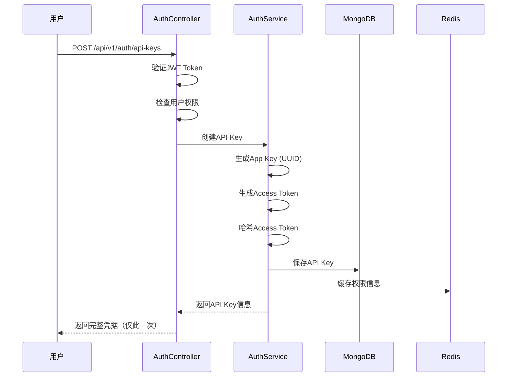
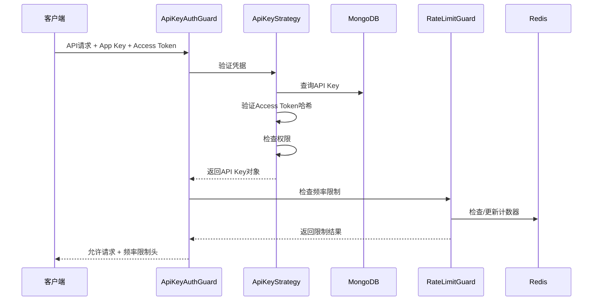

# API Key 管理系统文档

## 概述

API Key管理系统为第三方应用提供安全、可控的API访问机制。通过统一的权限验证架构和细粒度的权限控制，确保系统资源的合理使用。系统使用UnifiedPermissionsGuard进行统一的权限验证。

## 系统架构

```
┌─────────────────┐    ┌─────────────────┐    ┌─────────────────┐
│   Web Console   │───▶│  AuthController │───▶│   AuthService   │
└─────────────────┘    └─────────────────┘    └─────────────────┘
                                │                        │
                                ▼                        ▼
                       ┌─────────────────┐    ┌─────────────────┐
                       │ JWT Validation  │    │  MongoDB Store  │
                       └─────────────────┘    └─────────────────┘

┌─────────────────┐    ┌─────────────────┐    ┌─────────────────┐
│ Client Request  │───▶│ ApiKeyAuthGuard │───▶│ ApiKeyStrategy  │
└─────────────────┘    └─────────────────┘    └─────────────────┘
                                │                        │
                                ▼                        ▼
                       ┌─────────────────┐    ┌─────────────────┐
                       │UnifiedPermGuard │    │  Permission     │
                       └─────────────────┘    │  Service        │
                                │             └─────────────────┘
                                ▼
                       ┌─────────────────┐
                       │  RateLimitGuard │
                       └─────────────────┘
```

---

## 数据模型

### API Key Schema
```typescript
interface ApiKeyDocument {
  _id: ObjectId;                    // MongoDB文档ID
  appKey: string;                   // 应用密钥（UUID格式）
  accessToken: string;              // 访问令牌（32字符十六进制）
  name: string;                     // API Key名称
  description?: string;             // 描述信息
  createdBy: ObjectId;              // 创建者用户ID
  permissions: Permission[];        // 权限列表
  rateLimit: RateLimitConfig;       // 频率限制配置
  isActive: boolean;                // 是否激活
  usageCount: number;               // 使用次数统计
  lastUsedAt?: Date;                // 最后使用时间
  expiresAt?: Date;                 // 过期时间（可选）
  metadata?: Record<string, any>;   // 元数据（可选）
  createdAt: Date;                  // 创建时间
  updatedAt: Date;                  // 更新时间
}

interface RateLimitConfig {
  requests: number;                 // 请求数限制
  window: string;                   // 时间窗口（1s, 5m, 1h, 1d）
}

enum Permission {
  // 数据访问权限
  DATA_READ = "data:read",
  QUERY_EXECUTE = "query:execute",
  PROVIDERS_READ = "providers:read",

  // 开发者权限
  TRANSFORMER_PREVIEW = "transformer:preview",
  SYSTEM_MONITOR = "system:monitor",
  SYSTEM_METRICS = "system:metrics",
  SYSTEM_HEALTH = "system:health",
  DEBUG_ACCESS = "debug:access",
  CONFIG_READ = "config:read",

  // 管理员权限
  USER_MANAGE = "user:manage",
  APIKEY_MANAGE = "apikey:manage",
  CONFIG_WRITE = "config:write",
  MAPPING_WRITE = "mapping:write",
  SYSTEM_ADMIN = "system:admin",
}
```

### 数据库索引
```javascript
// MongoDB索引设计
db.apikeys.createIndex({ appKey: 1 }, { unique: true });
db.apikeys.createIndex({ accessToken: 1 }, { unique: true });
db.apikeys.createIndex({ createdBy: 1 });
db.apikeys.createIndex({ isActive: 1 });
db.apikeys.createIndex({ lastUsedAt: -1 });
db.apikeys.createIndex({ expiresAt: 1 }, { expireAfterSeconds: 0 });
```

---

## API 接口详解

### 1. 创建 API Key

```http
POST /api/v1/auth/api-keys
Authorization: Bearer {jwt_token}
Content-Type: application/json

{
  "name": "生产环境API Key",
  "description": "用于生产环境的股票数据获取",
  "permissions": [
    "data:read",
    "query:execute",
    "providers:read",
    "symbols:read"
  ],
  "rateLimit": {
    "requests": 10000,
    "window": "1h"
  },
  "expiresAt": "2025-12-31T23:59:59.999Z"
}
```

**响应示例：**
```json
{
  "statusCode": 201,
  "message": "API Key创建成功",
  "data": {
    "_id": "668b1234567890abcdef1234",
    "appKey": "f47ac10b-58cc-4372-a567-0e02b2c3d479",
    "accessToken": "a1b2c3d4e5f678901234567890abcdef",
    "name": "生产环境API Key",
    "description": "用于生产环境的股票数据获取",
    "permissions": [
      "data:read",
      "query:execute", 
      "providers:read",
      "symbols:read"
    ],
    "rateLimit": {
      "requests": 10000,
      "window": "1h"
    },
    "isActive": true,
    "usageCount": 0,
    "expiresAt": "2025-12-31T23:59:59.999Z",
    "createdAt": "2025-07-01T10:00:00.000Z",
    "updatedAt": "2025-07-01T10:00:00.000Z"
  },
  "timestamp": "2025-07-01T10:00:00.000Z"
}
```

### 2. 列出API Keys

```http
GET /api/v1/auth/api-keys?page=1&limit=10&isActive=true&sortBy=createdAt&sortOrder=desc
Authorization: Bearer {jwt_token}
```

**查询参数：**
- `page` - 页码（默认1）
- `limit` - 每页数量（默认10，最大100）
- `isActive` - 筛选激活状态
- `search` - 按名称或描述搜索
- `sortBy` - 排序字段（createdAt, lastUsedAt, usageCount, name）
- `sortOrder` - 排序方向（asc, desc）

**响应示例：**
```json
{
  "statusCode": 200,
  "message": "获取API Key列表成功",
  "data": {
    "items": [
      {
        "_id": "668b1234567890abcdef1234",
        "appKey": "f47ac10b-58cc-4372-a567-0e02b2c3d479",
        "name": "生产环境API Key", 
        "description": "用于生产环境的股票数据获取",
        "permissions": ["data:read", "query:execute"],
        "rateLimit": {
          "requests": 10000,
          "window": "1h"
        },
        "isActive": true,
        "usageCount": 156789,
        "lastUsedAt": "2025-07-01T09:45:30.000Z",
        "expiresAt": "2025-12-31T23:59:59.999Z",
        "createdAt": "2025-01-01T00:00:00.000Z",
        "updatedAt": "2025-07-01T09:45:30.000Z"
      }
    ],
    "pagination": {
      "page": 1,
      "limit": 10,
      "total": 25,
      "totalPages": 3,
      "hasNext": true,
      "hasPrev": false
    }
  },
  "timestamp": "2025-07-01T10:00:00.000Z"
}
```

### 3. 获取API Key详情

```http
GET /api/v1/auth/api-keys/{apiKeyId}
Authorization: Bearer {jwt_token}
```

**响应示例：**
```json
{
  "statusCode": 200,
  "message": "获取API Key详情成功",
  "data": {
    "_id": "668b1234567890abcdef1234",
    "appKey": "f47ac10b-58cc-4372-a567-0e02b2c3d479",
    "accessToken": "a1b2c3d4e5f6********", // 部分隐藏
    "name": "生产环境API Key",
    "description": "用于生产环境的股票数据获取",
    "permissions": [
      "data:read",
      "query:execute",
      "providers:read",
      "symbols:read"
    ],
    "rateLimit": {
      "requests": 10000,
      "window": "1h"
    },
    "isActive": true,
    "usageCount": 156789,
    "lastUsedAt": "2025-07-01T09:45:30.000Z",
    "expiresAt": "2025-12-31T23:59:59.999Z",
    "metadata": {
      "environment": "production",
      "client_version": "1.2.3"
    },
    "createdAt": "2025-01-01T00:00:00.000Z",
    "updatedAt": "2025-07-01T09:45:30.000Z",
    "createdBy": {
      "_id": "668a1234567890abcdef1234",
      "username": "developer1",
      "email": "dev@example.com"
    }
  },
  "timestamp": "2025-07-01T10:00:00.000Z"
}
```

### 4. 更新API Key

```http
PUT /api/v1/auth/api-keys/{apiKeyId}
Authorization: Bearer {jwt_token}
Content-Type: application/json

{
  "name": "更新后的API Key名称",
  "description": "更新后的描述",
  "permissions": [
    "data:read",
    "query:execute",
    "query:stats"
  ],
  "rateLimit": {
    "requests": 5000,
    "window": "1h"
  },
  "isActive": true,
  "expiresAt": "2026-12-31T23:59:59.999Z",
  "metadata": {
    "environment": "production",
    "client_version": "1.3.0"
  }
}
```

### 5. 重新生成访问令牌

```http
POST /api/v1/auth/api-keys/{apiKeyId}/regenerate-token
Authorization: Bearer {jwt_token}
```

**响应示例：**
```json
{
  "statusCode": 200,
  "message": "访问令牌重新生成成功",
  "data": {
    "appKey": "f47ac10b-58cc-4372-a567-0e02b2c3d479",
    "accessToken": "b2c3d4e5f67890123456789a0bcdef01",
    "message": "请保存新的访问令牌，旧令牌已失效"
  },
  "timestamp": "2025-07-01T10:00:00.000Z"
}
```

### 6. 获取使用统计

```http
GET /api/v1/auth/api-keys/{apiKeyId}/usage?period=7d&granularity=1h
Authorization: Bearer {jwt_token}
```

**查询参数：**
- `period` - 统计周期（1d, 7d, 30d, 90d）
- `granularity` - 数据粒度（1h, 1d, 1w）
- `timezone` - 时区（默认UTC）

**响应示例：**
```json
{
  "statusCode": 200,
  "message": "获取使用统计成功",
  "data": {
    "summary": {
      "totalRequests": 156789,
      "successfulRequests": 154321,
      "failedRequests": 2468,
      "averageRequestsPerHour": 929.1,
      "peakHour": "2025-07-01T14:00:00.000Z",
      "peakHourRequests": 1456
    },
    "currentUsage": {
      "currentPeriodRequests": 45,
      "limit": 10000,
      "remaining": 9955,
      "resetTime": 1751397600000,
      "utilizationRate": 0.45
    },
    "timeline": [
      {
        "timestamp": "2025-07-01T00:00:00.000Z",
        "requests": 678,
        "success": 675,
        "errors": 3
      },
      {
        "timestamp": "2025-07-01T01:00:00.000Z", 
        "requests": 724,
        "success": 720,
        "errors": 4
      }
    ],
    "topEndpoints": [
      {
        "endpoint": "/api/v1/receiver/data",
        "requests": 89543,
        "percentage": 57.1
      },
      {
        "endpoint": "/api/v1/query/execute",
        "requests": 45678,
        "percentage": 29.1
      }
    ],
    "errorBreakdown": [
      {
        "statusCode": 429,
        "count": 1234,
        "percentage": 50.0
      },
      {
        "statusCode": 400,
        "count": 987,
        "percentage": 40.0
      }
    ]
  },
  "timestamp": "2025-07-01T10:00:00.000Z"
}
```

### 7. 删除API Key

```http
DELETE /api/v1/auth/api-keys/{apiKeyId}
Authorization: Bearer {jwt_token}
```

**响应示例：**
```json
{
  "statusCode": 200,
  "message": "API Key删除成功",
  "data": {
    "deletedId": "668b1234567890abcdef1234",
    "deletedAt": "2025-07-01T10:00:00.000Z"
  },
  "timestamp": "2025-07-01T10:00:00.000Z"
}
```

---

## 权限系统详解

### 权限级别设计

#### 1. 数据访问权限
```typescript
// 读取数据权限
DATA_READ = 'data:read'
// 包含的端点：
// - GET /api/v1/receiver/data
// - GET /api/v1/storage/*
// - GET /api/v1/query/execute (只读查询)

// 写入数据权限（管理员功能）
DATA_WRITE = 'data:write'
// 包含的端点：
// - POST /api/v1/storage/*
// - PUT /api/v1/storage/*
// - DELETE /api/v1/storage/*
```

#### 2. 查询权限
```typescript
// 执行查询权限
QUERY_EXECUTE = 'query:execute'
// 包含的端点：
// - POST /api/v1/query/execute
// - GET /api/v1/query/results/*

// 查询统计权限
QUERY_STATS = 'query:stats'
// 包含的端点：
// - GET /api/v1/query/stats
// - GET /api/v1/query/performance

// 查询健康检查权限
QUERY_HEALTH = 'query:health'
// 包含的端点：
// - POST /api/v1/query/health-check
```

#### 3. 提供商权限
```typescript
// 查看提供商信息权限
PROVIDERS_READ = 'providers:read'
// 包含的端点：
// - GET /api/v1/providers/capabilities
// - GET /api/v1/providers/*/capabilities
// - GET /api/v1/providers/best-provider/*

// 管理提供商权限（管理员功能）
PROVIDERS_MANAGE = 'providers:manage'
// 包含的端点：
// - POST /api/v1/providers/*/configure
// - PUT /api/v1/providers/*/settings
```

### 权限检查机制

#### 1. 装饰器权限检查
```typescript
@ApiKeyAuth()
@RequirePermissions(Permission.DATA_READ, Permission.QUERY_EXECUTE)
@Get('data')
async getData(@Request() req) {
  // 自动检查权限，无权限返回403
}
```

#### 2. 程序化权限检查
```typescript
// 在服务中检查权限
if (!this.hasPermission(apiKey, Permission.DATA_READ)) {
  throw new ForbiddenException('权限不足：需要数据读取权限');
}
```

#### 3. 动态权限验证
```typescript
// 检查多个权限（AND逻辑）
@RequirePermissions(Permission.DATA_READ, Permission.QUERY_EXECUTE)

// 检查任一权限（OR逻辑）
@RequireAnyPermission(Permission.DATA_READ, Permission.DATA_WRITE)

// 自定义权限逻辑
@CustomPermissionCheck((apiKey, context) => {
  return apiKey.permissions.includes('custom:permission');
})
```

---

## 安全机制

### 1. 令牌安全

#### App Key 生成
```typescript
// 使用UUID v4确保唯一性和随机性
function generateAppKey(): string {
  return uuidv4(); // f47ac10b-58cc-4372-a567-0e02b2c3d479
}
```

#### Access Token 生成
```typescript
// 使用安全随机数生成32字符十六进制令牌
function generateAccessToken(): string {
  return crypto.randomBytes(16).toString('hex'); // 32字符
}
```

#### 令牌存储
```typescript
// Access Token哈希存储
const hashedToken = await bcrypt.hash(accessToken, 10);

// 保存到数据库时只存储哈希值
const apiKey = new ApiKeyModel({
  appKey,
  accessTokenHash: hashedToken, // 存储哈希值
  // ... 其他字段
});
```

#### 令牌验证
```typescript
// 验证时对比哈希值
async validateAccessToken(appKey: string, accessToken: string): Promise<boolean> {
  const apiKey = await this.findByAppKey(appKey);
  if (!apiKey) return false;
  
  return bcrypt.compare(accessToken, apiKey.accessTokenHash);
}
```

### 2. 请求安全

#### 防止重放攻击
```typescript
// 可选：添加时间戳和签名验证
interface SecureApiRequest {
  appKey: string;
  accessToken: string;
  timestamp: number;
  signature: string; // HMAC-SHA256签名
}

// 验证时间戳（5分钟有效期）
const isValidTimestamp = Math.abs(Date.now() - timestamp) < 5 * 60 * 1000;

// 验证签名
const expectedSignature = crypto
  .createHmac('sha256', apiKey.secretKey)
  .update(`${appKey}:${timestamp}:${requestBody}`)
  .digest('hex');
```

#### IP 白名单（可选）
```typescript
interface ApiKeyDocument {
  // ... 其他字段
  ipWhitelist?: string[]; // IP白名单
  ipBlacklist?: string[]; // IP黑名单
}

// IP验证
function validateIP(clientIP: string, apiKey: ApiKeyDocument): boolean {
  if (apiKey.ipBlacklist?.includes(clientIP)) return false;
  if (apiKey.ipWhitelist?.length && !apiKey.ipWhitelist.includes(clientIP)) return false;
  return true;
}
```

### 3. 数据保护

#### 敏感信息脱敏
```typescript
// 返回API Key信息时隐藏敏感数据
function sanitizeApiKey(apiKey: ApiKeyDocument): ApiKeyResponse {
  return {
    ...apiKey,
    accessToken: apiKey.accessToken.substring(0, 8) + '********', // 部分隐藏
    accessTokenHash: undefined, // 完全隐藏
  };
}
```

#### 审计日志
```typescript
// 记录所有API Key操作
interface ApiKeyAuditLog {
  apiKeyId: string;
  action: 'create' | 'update' | 'delete' | 'regenerate' | 'access';
  userId: string;
  clientIP: string;
  userAgent: string;
  timestamp: Date;
  details?: Record<string, any>;
}
```

---

## 生命周期管理

### 1. 创建流程



### 2. 使用流程



### 3. 清理流程

#### 过期清理
```typescript
// 定时清理过期的API Key
@Cron('0 0 * * *') // 每天午夜执行
async cleanupExpiredApiKeys(): Promise<void> {
  const expiredKeys = await this.apiKeyModel.find({
    expiresAt: { $lt: new Date() },
    isActive: true
  });

  for (const apiKey of expiredKeys) {
    // 标记为非激活
    await this.apiKeyModel.findByIdAndUpdate(apiKey._id, {
      isActive: false,
      deactivatedAt: new Date(),
      deactivationReason: 'expired'
    });

    // 清理Redis缓存
    await this.clearApiKeyCache(apiKey.appKey);
    
    // 记录审计日志
    await this.auditLogger.log({
      apiKeyId: apiKey._id,
      action: 'auto_deactivate',
      reason: 'expired',
      timestamp: new Date()
    });
  }
}
```

#### 非活跃清理
```typescript
// 清理长期未使用的API Key
@Cron('0 2 */7 * *') // 每周执行
async cleanupInactiveApiKeys(): Promise<void> {
  const inactiveThreshold = new Date(Date.now() - 90 * 24 * 60 * 60 * 1000); // 90天

  const inactiveKeys = await this.apiKeyModel.find({
    $or: [
      { lastUsedAt: { $lt: inactiveThreshold } },
      { lastUsedAt: null, createdAt: { $lt: inactiveThreshold } }
    ],
    isActive: true
  });

  // 发送通知给用户确认是否保留
  for (const apiKey of inactiveKeys) {
    await this.notificationService.sendInactiveApiKeyNotice(apiKey);
  }
}
```

---

## 监控和告警

### 1. 关键指标

```typescript
// 使用量指标
interface UsageMetrics {
  totalRequests: number;           // 总请求数
  requestsPerHour: number;         // 每小时请求数  
  successRate: number;             // 成功率
  averageResponseTime: number;     // 平均响应时间
  rateLimitHitRate: number;        // 频率限制命中率
}

// 安全指标
interface SecurityMetrics {
  failedAuthAttempts: number;      // 认证失败次数
  suspiciousRequests: number;      // 可疑请求数
  ipBasedAlerts: number;           // IP相关告警
  permissionDenials: number;       // 权限拒绝次数
}

// 系统指标
interface SystemMetrics {
  activeApiKeys: number;           // 活跃API Key数量
  totalApiKeys: number;            // 总API Key数量
  averagePermissionsPerKey: number; // 平均权限数
  expiringKeys: number;            // 即将过期的密钥数
}
```

### 2. 告警规则

```typescript
// 告警配置
const alertRules = {
  // 高频率认证失败
  highAuthFailureRate: {
    threshold: 100,
    window: '5m',
    action: 'block_ip'
  },
  
  // API Key即将过期
  apiKeyExpiring: {
    threshold: '7d',
    action: 'notify_user'
  },
  
  // 异常使用模式
  abnormalUsage: {
    threshold: '5x_average',
    window: '1h',
    action: 'investigate'
  },
  
  // 权限滥用尝试
  permissionAbuse: {
    threshold: 10,
    window: '1h',
    action: 'temporary_suspend'
  }
};
```

### 3. 监控面板

```typescript
// Grafana仪表板配置
const dashboardConfig = {
  panels: [
    {
      title: 'API Key使用趋势',
      type: 'graph',
      targets: ['api_key_requests_total'],
      timeRange: '24h'
    },
    {
      title: '频率限制命中率',
      type: 'stat',
      targets: ['rate_limit_hit_rate'],
      thresholds: [50, 80]
    },
    {
      title: '权限拒绝统计',
      type: 'pie',
      targets: ['permission_denials_by_permission'],
      timeRange: '7d'
    },
    {
      title: '活跃API Key数量',
      type: 'stat',
      targets: ['active_api_keys_count'],
      sparkline: true
    }
  ]
};
```

---

## 最佳实践

### 1. API Key设计
- 为不同环境（开发、测试、生产）创建独立的API Key
- 设置合理的过期时间，避免永久有效的密钥
- 根据最小权限原则分配权限
- 定期轮换访问令牌

### 2. 安全配置
- 启用IP白名单限制（生产环境推荐）
- 配置合适的频率限制避免滥用
- 监控异常使用模式
- 建立应急响应流程

### 3. 性能优化
- 使用Redis缓存减少数据库查询
- 批量操作提高效率
- 合理设置缓存过期时间
- 定期清理过期数据

### 4. 用户体验
- 提供清晰的权限说明文档
- 在控制台显示使用统计
- 及时通知即将过期的密钥
- 提供自助故障排查工具

---

*文档版本：v1.0.0*  
*最后更新：2025-07-01*