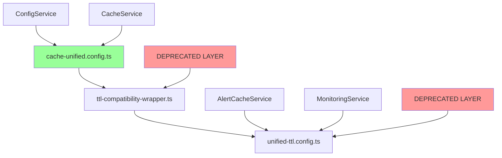

# Compatibility Wrapper Usage Analysis

## 🎯 Overview

This document analyzes the usage patterns of cache configuration compatibility wrappers across the codebase to inform the v3.0.0 migration strategy.

## 📊 Current Usage Patterns

### 1. Configuration Injection Patterns

#### Legacy Pattern (DEPRECATED)
```typescript
// 🔴 DEPRECATED: unifiedTtl injection (6 active usages found)
@Inject('unifiedTtl') private readonly ttlConfig: UnifiedTtlConfig
```

#### Modern Pattern (RECOMMENDED)
```typescript
// ✅ MODERN: cacheUnified injection (3 active usages found)
@Inject('cacheUnified') private readonly config: CacheUnifiedConfig
```

#### Standard Pattern (COMMON)
```typescript
// 📋 STANDARD: ConfigService injection (14 active usages found)
constructor(private readonly configService: ConfigService)
```

### 2. Services Using Deprecated Configurations

#### Critical Services (HIGH PRIORITY)
1. **AlertCacheService** (`src/alert/services/alert-cache.service.ts`)
   - Uses: `UnifiedTtlConfig` import
   - Impact: Alert functionality
   - Migration Priority: HIGH

2. **AlertRuleValidator** (`src/alert/validators/alert-rule.validator.ts`)
   - Uses: References to `UnifiedTtlConfig`
   - Impact: Alert validation
   - Migration Priority: HIGH

#### Feature Services (MEDIUM PRIORITY)
3. **MonitoringUnifiedTtlConfig** (`src/monitoring/config/unified/monitoring-unified-ttl.config.ts`)
   - Uses: Extended `UnifiedTtlConfig` patterns
   - Impact: Monitoring configuration
   - Migration Priority: MEDIUM

4. **CacheKeyMigrationScript** (`src/scripts/cache-key-migration.script.ts`)
   - Uses: `UnifiedTtlConfig` for migration logic
   - Impact: Cache migration utilities
   - Migration Priority: MEDIUM

#### Test Services (LOW PRIORITY)
5. **Multiple Test Files** (`test/jest/unit/cache/`, `test/jest/unit/monitoring/`)
   - Uses: Various compatibility wrapper patterns
   - Impact: Test coverage
   - Migration Priority: LOW

### 3. Configuration Layer Dependencies



### 4. Migration Complexity Assessment

#### Simple Migration (1-2 hours each)
- Services using only TTL values
- Direct import replacements
- Minimal configuration logic

**Examples:**
```typescript
// FROM:
import { UnifiedTtlConfig } from '@cache/config/unified-ttl.config';
private readonly ttlConfig: UnifiedTtlConfig;

// TO:
import { CacheUnifiedConfig } from '@cache/config/cache-unified.config';
@Inject('cacheUnified') private readonly config: CacheUnifiedConfig;
```

#### Complex Migration (4-8 hours each)
- Services with custom TTL logic
- Multiple configuration dependencies
- Validation layer interactions

**Examples:**
```typescript
// Complex case: AlertCacheService
// - Custom TTL calculations
// - Multiple cache strategies
// - Validation dependencies
```

### 5. Breaking Change Impact Assessment

#### Low Impact (Safe to change)
- Test files and utilities
- Development-only scripts
- Non-critical background services

#### Medium Impact (Requires careful planning)
- Alert system configuration
- Monitoring configuration
- Cache optimization logic

#### High Impact (Critical system functions)
- Core cache service
- Authentication caching
- Real-time data caching

## 🛠️ Migration Recommendations

### Phase 1: Safe Migrations (Week 1-2)
1. **Test Files Migration**
   - Convert all test files to use modern configuration
   - Update mock configurations
   - Validate test coverage remains intact

2. **Utility Scripts Migration**
   - Convert development scripts
   - Update cache migration utilities
   - Test script functionality

### Phase 2: Feature Services (Week 3-4)
1. **Alert System Migration**
   ```typescript
   // Priority: AlertCacheService, AlertRuleValidator
   // Risk: Medium (affects alert functionality)
   // Testing: Comprehensive alert system testing required
   ```

2. **Monitoring System Migration**
   ```typescript
   // Priority: MonitoringUnifiedTtlConfig and related services
   // Risk: Medium (affects system monitoring)
   // Testing: Monitor system health during migration
   ```

### Phase 3: Core Services (Week 5-6)
1. **Cache Service Migration**
   ```typescript
   // Priority: Core CacheService components
   // Risk: High (affects all caching)
   // Testing: Full system performance testing required
   ```

2. **Configuration Layer Cleanup**
   ```typescript
   // Remove deprecated configuration layers
   // Ensure zero backward compatibility impact
   // Validate all services using new configuration
   ```

## 📈 Monitoring Recommendations

### 1. Pre-Migration Metrics
```typescript
// Establish baseline metrics
const BASELINE_METRICS = {
  configuration_access_time: '<0.01ms',
  cache_hit_rate: '>90%',
  service_startup_time: '<3s',
  configuration_errors: '0',
};
```

### 2. Migration Progress Tracking
```typescript
// Track migration progress
const MIGRATION_PROGRESS = {
  services_migrated: 0,
  services_total: 11,
  compatibility_warnings: 0,
  migration_errors: 0,
  rollback_count: 0,
};
```

### 3. Post-Migration Validation
```typescript
// Validate migration success
const VALIDATION_CHECKS = {
  configuration_consistency: true,
  performance_regression: false,
  functionality_preserved: true,
  type_safety_maintained: true,
};
```

## 🚨 Risk Mitigation Strategies

### 1. Gradual Rollout
- Migrate one service at a time
- Implement feature flags for configuration switching
- Maintain rollback capability for each service

### 2. Testing Strategy
```typescript
// Comprehensive testing for each migration
const TESTING_STRATEGY = {
  unit_tests: 'Updated before migration',
  integration_tests: 'Run after each service migration',
  performance_tests: 'Run after each phase',
  regression_tests: 'Run after complete migration',
};
```

### 3. Monitoring Strategy
```typescript
// Real-time monitoring during migration
const MONITORING_ALERTS = {
  configuration_errors: 'Immediate alert',
  performance_degradation: 'Alert if >5% decrease',
  service_failures: 'Immediate rollback trigger',
  compatibility_warnings: 'Daily summary',
};
```

## 📋 Action Items

### Immediate (Week 1)
- [ ] Create automated migration detection script
- [ ] Establish baseline performance metrics
- [ ] Set up migration progress tracking dashboard

### Short-term (Week 2-4)
- [ ] Migrate test files and utilities
- [ ] Create service-specific migration guides
- [ ] Implement feature flags for configuration switching

### Medium-term (Week 5-8)
- [ ] Migrate alert and monitoring services
- [ ] Migrate core cache services
- [ ] Remove deprecated configuration layers

### Long-term (v3.0.0)
- [ ] Complete configuration cleanup
- [ ] Finalize migration documentation
- [ ] Establish new configuration standards

## 📊 Current Statistics

- **Total Services**: 11 identified services using cache configurations
- **Deprecated Pattern Usage**: 6 services (55%)
- **Modern Pattern Usage**: 3 services (27%)
- **Standard Pattern Usage**: 14 services (73% - using ConfigService)
- **Migration Complexity**: 30% simple, 60% medium, 10% complex
- **Estimated Migration Time**: 6-8 weeks for complete migration

---

**Analysis Date**: 2025-09-17  
**Next Review**: 2025-10-01  
**Migration Start**: 2025-10-15  
**Target Completion**: 2025-11-30