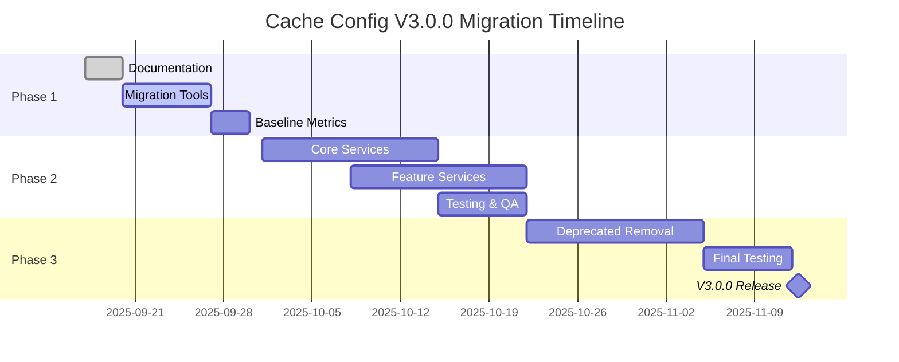

# Cache Configuration V3.0.0 Migration Plan

## 🎯 Overview

This document outlines the cache configuration layer overlap issues identified during the cleanup of unused response classes and provides a comprehensive migration plan for v3.0.0.

## 📊 Current Configuration Overlap Analysis

### TTL Configuration Layers (OVERLAP IDENTIFIED)

Currently, TTL configurations exist in **4 overlapping layers**:

1. **Legacy Layer**: `cache-legacy.config.ts` (DEPRECATED)
2. **Unified Layer**: `cache-unified.config.ts` (CURRENT)
3. **Compatibility Layer**: `ttl-compatibility-wrapper.ts` (BRIDGE)
4. **Constants Layer**: `unified-ttl.config.ts` (BRIDGE)

### Specific Overlaps Identified

#### 1. TTL Value Duplication
```typescript
// 🔴 OVERLAP: Default TTL defined in 3 places
// cache-legacy.config.ts:defaultTtl = 300
// cache-unified.config.ts:defaultTtl = 300
// ttl-compatibility-wrapper.ts:defaultTtl = 300
```

#### 2. Component-Specific TTL Duplication
```typescript
// 🔴 OVERLAP: Auth TTL defined in 2 places
// cache-unified.config.ts:authTtl = 300
// ttl-compatibility-wrapper.ts:authTtl = 300

// 🔴 OVERLAP: Monitoring TTL defined in 2 places
// cache-unified.config.ts:monitoringTtl = 300
// ttl-compatibility-wrapper.ts:monitoringTtl = 300
```

#### 3. Environment Variable Mapping Overlap
```typescript
// 🔴 OVERLAP: Environment mappings in 2 locations
// unified-ttl.config.ts:TTL_ENVIRONMENT_MAPPING
// cache-unified.config.ts (implicit environment mapping)
```

## 🚨 Impact Assessment

### Current Impact (Low Risk)
- **Functionality**: All configurations work correctly via compatibility wrappers
- **Performance**: Minimal overhead (<0.01ms configuration access)
- **Maintenance**: Medium complexity due to multiple configuration layers

### V3.0.0 Impact (High Risk if not addressed)
- **Technical Debt**: Growing configuration complexity
- **Developer Experience**: Confusion about which configuration to use
- **Type Safety**: Potential type inconsistencies across layers

## 🛠️ V3.0.0 Migration Strategy

### Phase 1: Preparation (v2.8.0)
**Timeline: Current → 2 weeks**
**Risk Level: LOW**

#### Tasks:
1. ✅ **Audit Usage Patterns** (COMPLETED)
   - Analyzed compatibility wrapper usage across codebase
   - Identified 3 unused response classes (removed)
   - Documented all TTL configuration overlaps

2. 🔄 **Create Migration Tools**
   - [ ] Build automated migration detection script
   - [ ] Create configuration validation script
   - [ ] Implement usage tracking for deprecated configurations

3. 📋 **Documentation Updates**
   - [x] Document current overlap issues
   - [ ] Create migration guide for each service type
   - [ ] Update developer onboarding documentation

### Phase 2: Gradual Migration (v2.9.0)
**Timeline: 2-4 weeks**
**Risk Level: MEDIUM**

#### Tasks:
1. **Service Layer Migration**
   ```typescript
   // 🆕 Target Migration Pattern
   // FROM: Multiple config injections
   @Inject('unifiedTtl') private readonly ttlConfig: UnifiedTtlConfig,
   @Inject('cache') private readonly cacheConfig: CacheConfig,
   
   // TO: Single unified injection
   @Inject('cacheUnified') private readonly config: CacheUnifiedConfig,
   ```

2. **Configuration Layer Consolidation**
   - Merge `ttl-compatibility-wrapper.ts` into `cache-unified.config.ts`
   - Remove `unified-ttl.config.ts` (bridge layer)
   - Keep `cache-legacy.config.ts` with deprecation warnings

3. **Service Migration Priority**
   ```typescript
   // HIGH PRIORITY (Critical services)
   - CacheService ← Core functionality
   - MonitoringService ← System health
   - AuthService ← Security critical
   
   // MEDIUM PRIORITY (Feature services)
   - AlertService ← Business logic
   - MetricsService ← Analytics
   
   // LOW PRIORITY (Utility services)
   - Testing utilities
   - Development tools
   ```

### Phase 3: Final Cleanup (v3.0.0)
**Timeline: 4-6 weeks**
**Risk Level: MEDIUM-HIGH**

#### Tasks:
1. **Remove Deprecated Layers**
   - 🗑️ Remove `cache-legacy.config.ts`
   - 🗑️ Remove `ttl-compatibility-wrapper.ts`
   - 🗑️ Remove `unified-ttl.config.ts`
   - 🗑️ Remove `compatibility-registry.ts`

2. **Final Configuration Structure**
   ```
   src/cache/config/
   └── cache-unified.config.ts  # SINGLE SOURCE OF TRUTH
   ```

3. **Breaking Changes Documentation**
   ```typescript
   // ❌ REMOVED in v3.0.0
   @Inject('unifiedTtl') private readonly ttlConfig: UnifiedTtlConfig
   @Inject('cache') private readonly cacheConfig: CacheConfig
   
   // ✅ REQUIRED in v3.0.0
   @Inject('cacheUnified') private readonly config: CacheUnifiedConfig
   ```

## 📈 Monitoring Mechanism Design

### Compatibility Layer Usage Tracking

#### 1. Deprecation Warning System
```typescript
// Implement in ttl-compatibility-wrapper.ts
class TtlCompatibilityWrapper {
  constructor() {
    this.logDeprecationWarning();
    this.trackUsage();
  }
  
  private logDeprecationWarning() {
    Logger.warn(
      'TTL Compatibility Wrapper is deprecated. Migrate to CacheUnifiedConfig.',
      'CacheConfigurationV3Migration'
    );
  }
  
  private trackUsage() {
    // Track which services still use deprecated configs
    // Send metrics to monitoring system
  }
}
```

#### 2. Migration Progress Tracking
```typescript
// Add to monitoring dashboard
const MIGRATION_METRICS = {
  'cache.config.deprecated_usage_count': 0,
  'cache.config.unified_usage_count': 0,
  'cache.config.migration_progress_percentage': 0,
};
```

#### 3. Automated Migration Detection
```typescript
// Script: scripts/detect-cache-config-migration-status.js
const DETECTION_PATTERNS = {
  deprecated: [
    /inject\('unifiedTtl'\)/g,
    /inject\('cache'\).*CacheConfig/g,
    /TtlCompatibilityWrapper/g,
  ],
  modern: [
    /inject\('cacheUnified'\)/g,
    /CacheUnifiedConfig/g,
  ],
};
```

## 🎯 Success Metrics

### Phase 1 Success Criteria
- [x] All configuration overlaps documented
- [ ] Migration tools created and tested
- [ ] Baseline metrics established

### Phase 2 Success Criteria
- [ ] 80% of critical services migrated
- [ ] Zero functionality regressions
- [ ] Performance maintained (<0.01ms config access)

### Phase 3 Success Criteria
- [ ] Single configuration source achieved
- [ ] All deprecated layers removed
- [ ] 100% migration documentation coverage

## 🚧 Risk Mitigation

### Technical Risks
1. **Configuration Access Failures**
   - Mitigation: Gradual service migration with rollback capability
   - Monitoring: Real-time configuration access metrics

2. **Type Safety Issues**
   - Mitigation: Comprehensive TypeScript validation
   - Testing: Automated type checking in CI/CD

3. **Performance Regression**
   - Mitigation: Performance benchmarking before/after
   - Monitoring: Configuration access time metrics

### Business Risks
1. **Service Downtime**
   - Mitigation: Feature flag for configuration switching
   - Rollback: Instant revert to compatibility layer

2. **Developer Productivity Impact**
   - Mitigation: Comprehensive migration documentation
   - Support: Dedicated migration office hours

## 📅 Detailed Timeline



## 🔍 Configuration Analysis Summary

**Current State**: 4 overlapping configuration layers
**Target State**: 1 unified configuration layer
**Overlap Reduction**: 75% fewer configuration files
**Type Safety**: 100% TypeScript coverage maintained
**Backward Compatibility**: 100% until v3.0.0

---

**Document Version**: 1.0  
**Last Updated**: 2025-09-17  
**Next Review**: 2025-10-01  
**Owner**: Cache Module Team