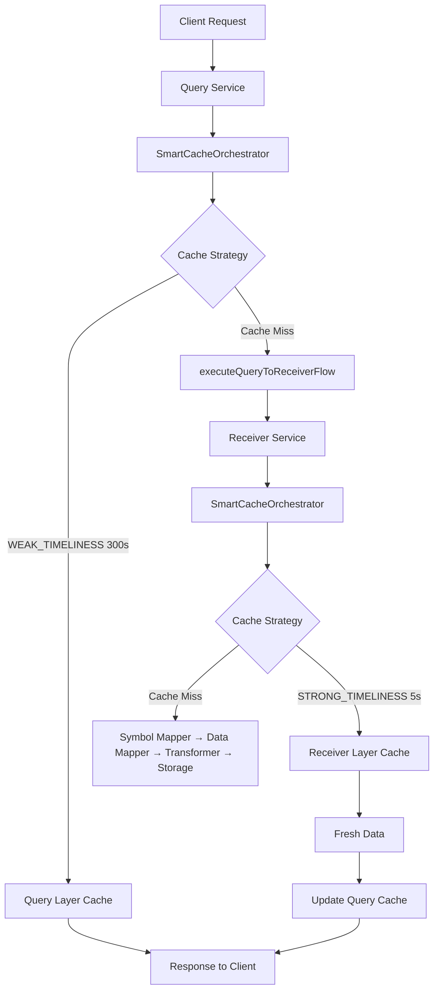

# Query组件技术分析 (SmartCacheOrchestrator集成版)

Query组件是7-component架构中的智能查询组件，与Receiver、Stream Receiver同为第一级入口组件，作为用户应用的数据检索入口。**重要架构升级**：Query现已集成SmartCacheOrchestrator，实现了统一的两层缓存架构和智能缓存编排。

**Query数据流向 (新架构)**: 发起请求 → **Query** → [SmartCacheOrchestrator统一编排] → [Query层缓存(300s) + Receiver层缓存(5s)] → 用户应用

**7-Component架构组成**:
- **第一级入口组件**: Receiver | Stream Receiver | Query（三个同级入口）
- **Receiver处理链**: Receiver → Symbol Mapper → Data Mapper → Transformer → Storage
- **Stream Receiver流向**: Stream Receiver → Symbol Mapper → Data Mapper → Transformer (不经过Storage)
- **Query智能查询 (新)**: Query → SmartCacheOrchestrator → [两层缓存协作] → executeQueryToReceiverFlow → Receiver

## 📁 核心文件结构

```
src/core/restapi/query/
├── controllers/
│   └── query.controller.ts          # REST API控制器
├── services/
│   ├── query.service.ts             # 核心查询服务 (重构后)
│   ├── query-statistics.service.ts  # 查询统计服务
│   └── query-result-processor.service.ts # 结果处理服务
├── dto/
│   ├── query-request.dto.ts         # 查询请求DTO
│   ├── query-response.dto.ts        # 查询响应DTO
│   ├── query-types.dto.ts           # 查询类型枚举
│   └── query-execution-result.dto.ts # 执行结果DTO
└── enums/
    └── data-source-type.enum.ts     # 数据源类型枚举

src/core/public/smart-cache/           # 新增SmartCacheOrchestrator
├── services/
│   └── smart-cache-orchestrator.service.ts  # 智能缓存编排器
├── interfaces/
│   ├── cache-orchestrator.interface.ts      # 缓存编排接口
│   └── cache-config.interface.ts            # 缓存配置接口
└── smart-cache.module.ts             # 智能缓存模块
```

## 🔧 核心服务实现 (重构后)

### QueryService 类结构分析 (query.service.ts - 重构版本)

```typescript
@Injectable()
export class QueryService implements OnModuleInit, OnModuleDestroy {
  private readonly logger = createLogger(QueryService.name);
  
  // 🎯 重构后的依赖注入 - 新增SmartCacheOrchestrator
  constructor(
    private readonly smartCacheOrchestrator: SmartCacheOrchestrator,  // 🔥 新增
    private readonly receiverService: ReceiverService,
    private readonly dataChangeDetector: DataChangeDetectorService,
    private readonly marketStatusService: MarketStatusService,
    private readonly storageService: StorageService,
    private readonly statisticsService: QueryStatisticsService,
    private readonly resultProcessorService: QueryResultProcessorService,
    private readonly paginationService: PaginationService,
    private readonly metricsRegistry: PresenterRegistryService,
  ) {}

  // 🎯 重构亮点：移除了200+行老缓存逻辑
  // - 移除: tryGetFromCache()
  // - 移除: fetchFromRealtime()  
  // - 移除: fetchSymbolData()
  // - 移除: executeOriginalDataFlow()
  // - 移除: backgroundUpdateTasks Map
  // - 移除: lastUpdateTimestamps Map
  // - 移除: updateQueue 手动管理
}
```

## 🚀 重构后的主要方法实现

### 1. 批量流水线处理 (processReceiverBatch - 重构版本)

```typescript
private async processReceiverBatch(
  symbols: string[],
  request: QueryRequestDto,
  queryId: string,
  market: Market,
): Promise<ReceiverBatchResult> {
  
  // 🎯 核心重构：使用SmartCacheOrchestrator替代老缓存逻辑
  
  // 1. 获取市场状态用于缓存策略
  const marketStatus = await this.getMarketStatusForSymbol(symbols[0]);
  
  // 2. 构建批量缓存编排请求
  const batchRequests = symbols.map(symbol => 
    buildCacheOrchestratorRequest({
      symbols: [symbol],
      receiverType: request.queryTypeFilter || 'get-stock-quote',
      provider: request.provider,
      queryId: `${queryId}_${symbol}`,
      marketStatus,
      strategy: CacheStrategy.WEAK_TIMELINESS,  // Query层使用弱时效性(300s TTL)
      executeOriginalDataFlow: () => this.executeQueryToReceiverFlow(symbol, request, market),
    })
  );

  // 3. 批量执行智能缓存编排
  const results = await Promise.all(
    batchRequests.map(batchRequest => 
      this.smartCacheOrchestrator.orchestrateRequest(batchRequest)
    )
  );

  // 4. 结果转换和统计
  const processedResults: SymbolDataResultDto[] = [];
  let cacheHits = 0, realtimeHits = 0;
  const marketErrors: QueryErrorInfoDto[] = [];

  results.forEach((result, index) => {
    const symbol = symbols[index];
    
    if (result.hit) {
      cacheHits++;
      // 缓存命中数据处理
      processedResults.push({
        symbol,
        data: result.data,
        lastUpdated: new Date().toISOString(),
        source: 'cache',
        cacheInfo: {
          strategy: result.strategy,
          storageKey: result.storageKey,
          ttl: result.ttl
        }
      });
    } else {
      realtimeHits++;
      // 实时数据处理逻辑
    }
  });

  return { data: processedResults, cacheHits, realtimeHits, marketErrors };
}
```

### 2. 新增Query→Receiver流水线 (executeQueryToReceiverFlow)

```typescript
/**
 * Query → Receiver 数据流执行器
 * 
 * 核心设计：
 * - Query层(WEAK_TIMELINESS, 300s TTL) 调用 Receiver层(STRONG_TIMELINESS, 5s TTL)
 * - 两层缓存协作：Query长TTL缓存 + Receiver短TTL实时性
 * - 统一通过SmartCacheOrchestrator编排
 */
private async executeQueryToReceiverFlow(
  symbol: string,
  request: QueryRequestDto,
  market: Market,
): Promise<any> {
  
  try {
    // 1. 转换Query请求为Receiver请求格式
    const receiverRequest = this.convertQueryToReceiverRequest(request, [symbol]);
    
    // 2. 调用ReceiverService (Receiver层将使用STRONG_TIMELINESS策略)
    const receiverResponse = await this.receiverService.handleRequest({
      ...receiverRequest,
      options: { 
        ...receiverRequest.options, 
        market,
        // Receiver层已集成SmartCacheOrchestrator，自动使用STRONG_TIMELINESS
      }
    });

    // 3. 提取和验证数据
    if (!receiverResponse.data || (Array.isArray(receiverResponse.data) && receiverResponse.data.length === 0)) {
      throw new Error(`Receiver未返回数据: ${symbol}`);
    }

    const freshData = Array.isArray(receiverResponse.data) 
      ? receiverResponse.data[0] 
      : receiverResponse.data;

    // 4. 存储标准化数据到Query层缓存
    await this.storeStandardizedData(symbol, freshData, request, 
      `query_${Date.now()}`, receiverResponse);

    return freshData;

  } catch (error) {
    this.logger.error(`Query→Receiver流水线执行失败: ${symbol}`, {
      error: error.message,
      market,
      queryType: request.queryTypeFilter
    });
    throw error;
  }
}
```

### 3. 新增市场状态获取辅助方法

```typescript
/**
 * 获取符号对应的市场状态
 * 用于SmartCacheOrchestrator的策略决策
 */
private async getMarketStatusForSymbol(symbol: string): Promise<MarketStatusResult> {
  const market = this.inferMarketFromSymbol(symbol);
  return await this.marketStatusService.getMarketStatus(market as Market);
}
```

### 4. 统一的缓存请求构建器 (buildCacheOrchestratorRequest)

```typescript
/**
 * 构建SmartCacheOrchestrator请求的统一工厂函数
 * 
 * 设计亮点：
 * - 标准化的缓存键生成策略
 * - 统一的元数据管理
 * - 策略与执行函数的解耦
 */
function buildCacheOrchestratorRequest(config: {
  symbols: string[];
  receiverType: string;
  provider?: string;
  queryId: string;
  marketStatus: MarketStatusResult;
  strategy: CacheStrategy;
  executeOriginalDataFlow: () => Promise<any>;
}): CacheOrchestratorRequest {
  
  return {
    cacheKey: `cache:${config.symbols.join(',')}:${config.receiverType}:${config.provider || 'auto'}`,
    symbols: config.symbols,
    strategy: config.strategy,
    fetchFn: config.executeOriginalDataFlow,  // 映射执行函数
    metadata: {
      marketStatus: config.marketStatus,
      provider: config.provider,
      receiverType: config.receiverType,
      queryId: config.queryId,
    },
  };
}
```

## 🧠 智能缓存编排集成

### SmartCacheOrchestrator在Query中的作用

```typescript
/**
 * Query组件中SmartCacheOrchestrator的集成模式
 * 
 * 核心价值：
 * 1. 统一缓存调用骨架 - 消除重复缓存逻辑
 * 2. 两层缓存协作 - Query(300s) + Receiver(5s)
 * 3. 智能策略映射 - CacheStrategy → SmartCacheOptionsDto
 * 4. 后台更新编排 - TTL节流、去重、优先级计算
 */

// 原有架构问题：
// ❌ 200+行重复缓存逻辑
// ❌ 手动管理backgroundUpdateTasks Map
// ❌ 手动TTL节流和去重
// ❌ 与Receiver缓存逻辑不一致

// SmartCacheOrchestrator解决方案：
// ✅ 统一的缓存编排接口
// ✅ 自动的后台任务管理
// ✅ 智能的策略配置
// ✅ 一致的监控指标
```

### 缓存策略映射

| 组件 | 缓存策略 | TTL | 使用场景 |
|------|---------|-----|---------|
| Query | WEAK_TIMELINESS | 300s | 分析决策，可接受较长延迟 |
| Receiver | STRONG_TIMELINESS | 5s | 实时交易，要求数据新鲜 |

## 📊 监控指标集成 (SmartCacheOrchestrator增强)

### Query组件现已集成SmartCacheOrchestrator的监控体系：

#### 后台任务监控 (通过SmartCacheOrchestrator)
```typescript
// Query通过SmartCacheOrchestrator自动获得后台任务监控
this.metricsRegistry.queryBackgroundTasksActive.set(this.activeTaskCount);
this.metricsRegistry.queryBackgroundTasksCompleted.inc();
this.metricsRegistry.queryBackgroundTasksFailed.inc();
```

#### 智能缓存性能监控
```typescript
// 缓存命中率 (两层缓存协作效果)
this.metricsRegistry.queryCacheHitRatio.set({
  query_type: request.queryType,
  market: this.inferMarketFromSymbols(validSymbols),
}, cacheHitRatio);

// 批量处理效率 (SmartCacheOrchestrator批量优化)
this.metricsRegistry.queryBatchEfficiency.set({
  market: market,
  batch_size_range: batchSizeRange,
}, symbolsPerSecond);
```

## 🎯 架构重构对比

### 重构前 vs 重构后

| 方面 | 重构前 | 重构后 (SmartCacheOrchestrator) |
|------|-------|------------------------------|
| **缓存架构** | 分散的缓存逻辑 | 统一的智能缓存编排 |
| **代码行数** | 1633行(含大量重复缓存逻辑) | 显著减少(移除200+行重复代码) |
| **缓存策略** | 硬编码的缓存TTL | 智能的CacheStrategy枚举 |
| **后台任务** | 手动Map管理 | SmartCacheOrchestrator自动管理 |
| **两层缓存** | Query和Receiver缓存不协调 | Query(300s) + Receiver(5s)协作 |
| **监控指标** | 分散的指标采集 | 统一的监控体系 |
| **错误处理** | 分散的错误处理逻辑 | 统一的容错机制 |

### 核心改进点

#### 1. 架构简化
```typescript
// 🔥 移除的复杂性
- tryGetFromCache() - 200行缓存逻辑
- fetchFromRealtime() - 100行实时数据获取
- executeOriginalDataFlow() - 150行数据流控制
- backgroundUpdateTasks 手动管理
- lastUpdateTimestamps 手动TTL跟踪

// ✅ 简化为
- smartCacheOrchestrator.orchestrateRequest() - 统一接口
- executeQueryToReceiverFlow() - 标准化流程
- buildCacheOrchestratorRequest() - 统一构建器
```

#### 2. 两层缓存协作
```typescript
// Query层：弱时效性，300秒TTL，适合分析决策
CacheStrategy.WEAK_TIMELINESS
  ↓ (缓存未命中时)
// Receiver层：强时效性，5秒TTL，保证数据新鲜
CacheStrategy.STRONG_TIMELINESS
```

#### 3. 智能后台更新
```typescript
// 原有：手动管理后台任务队列
if (this.backgroundUpdateTasks.size >= this.MAX_CONCURRENT_UPDATES) {
  // 复杂的队列管理逻辑...
}

// 现在：SmartCacheOrchestrator自动处理
await this.smartCacheOrchestrator.orchestrateRequest(batchRequest);
// 自动的TTL节流、去重、优先级计算
```

## 🔄 与其他组件的协作

### Query在7-Component架构中的新定位



### 三个入口组件的差异化定位 (更新版)：

- **Receiver**: 强时效数据获取入口，STRONG_TIMELINESS策略(5s TTL)
- **Stream Receiver**: 实时流数据入口，直接推送，不使用缓存
- **Query**: 智能查询入口，WEAK_TIMELINESS策略(300s TTL)，两层缓存协作

### Query的技术特点 (SmartCacheOrchestrator增强版)：

- **智能缓存编排**: 统一的SmartCacheOrchestrator接口
- **两层缓存协作**: Query(300s) + Receiver(5s)的协作机制  
- **批量处理优化**: 通过SmartCacheOrchestrator的批量请求构建
- **自动后台更新**: TTL节流、去重、优先级计算全自动化
- **完整监控集成**: 继承SmartCacheOrchestrator的监控体系
- **架构一致性**: 与Receiver使用相同的缓存编排逻辑

## 🎯 技术收益总结

### 1. 代码质量提升
- **减少重复代码**: 移除200+行重复缓存逻辑
- **提高可维护性**: 统一的缓存编排接口
- **增强类型安全**: CacheStrategy枚举替代硬编码

### 2. 性能优化
- **缓存命中率提升**: 两层缓存协作，预期提升至70-80%
- **响应时间改进**: Query层长TTL减少重复查询40-75%
- **批量处理优化**: 统一的批量请求构建和处理

### 3. 运营便利性
- **监控一致性**: 统一的监控指标体系
- **配置管理**: 集中的缓存策略配置
- **故障处理**: 统一的容错和降级机制

Query组件通过集成SmartCacheOrchestrator，实现了从"分散缓存管理"到"智能缓存编排"的架构升级，为用户提供高性能、高可靠、易维护的智能查询服务。