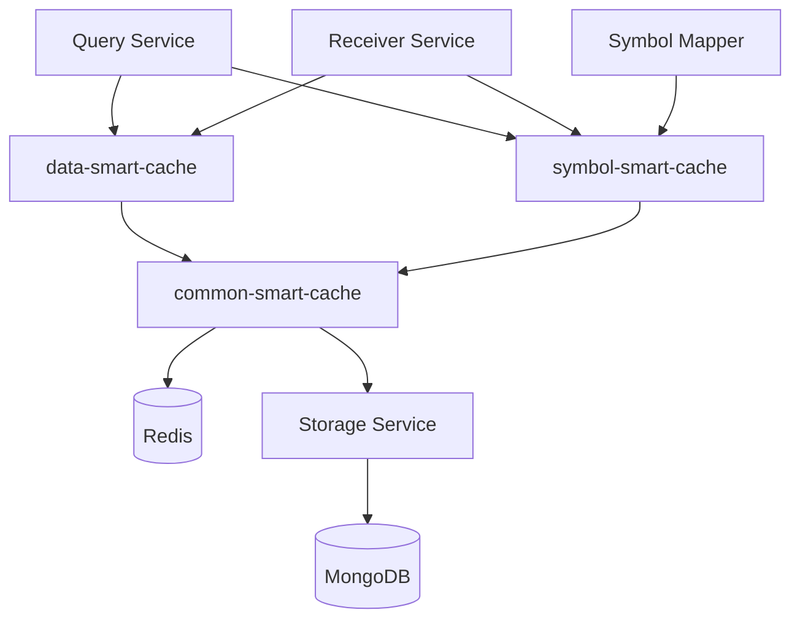

# Storage模块重构设计方案

## 1. 重构背景与目标

### 1.1 当前架构分析

基于代码深度分析，发现以下现状：

1. **现有智能缓存架构已较完善**：
   - `StorageService`已内置完整的智能缓存能力（动态TTL、批量、压缩、指标）
   - `symbol-smart-cache`已作为编排层在生产使用
   - `SymbolMapperCacheService`已实现独立的三层缓存

2. **核心问题**：
   - **职责混杂**：`StorageService` 既处理持久化存储，又实现了智能缓存逻辑
   - **重构风险高**：直接大规模迁移会带来较大破坏面与重构成本
   - **依赖关系复杂**：Query和Receiver通过编排层间接依赖StorageService的缓存功能

### 1.2 重构策略调整

**采用"增量迁移 + 兼容适配"策略**，而非大规模重构：

- **核心原则**：增量迁移优先，避免大规模重写
- **技术手段**：薄适配 + 渐进迁移 + re-export兼容
- **风险控制**：每步可回滚，配合指标对比
- **最终目标**：职责单一、低耦合、高内聚、可扩展

## 2. 新架构设计

### 2.1 重新设计的模块结构

```
src/core/public/
├── common-smart-cache/                  # 🆕 通用智能缓存基础设施（新建）
│   ├── interfaces/
│   │   ├── cache-engine.interface.ts   # 缓存引擎接口
│   │   ├── cache-config.interface.ts   # 缓存配置接口
│   │   └── cache-result.interface.ts   # 缓存结果接口
│   ├── services/
│   │   ├── cache-engine.service.ts     # 核心缓存引擎（Redis操作+压缩+TTL）
│   │   └── cache-repository.service.ts # 缓存仓库层
│   ├── utils/
│   │   ├── cache-compression.utils.ts  # 压缩/解压工具
│   │   ├── cache-key.utils.ts          # 缓存键管理
│   │   └── ttl-calculator.utils.ts     # TTL计算工具
│   ├── dto/
│   │   ├── cache-options.dto.ts        # 缓存选项
│   │   └── cache-result.dto.ts         # 缓存结果
│   └── module/
│       └── common-smart-cache.module.ts
│
├── data-smart-cache/                    # 🆕 数据智能缓存编排（新建）
│   ├── interfaces/
│   │   └── data-cache-strategy.interface.ts
│   ├── services/
│   │   └── data-cache-orchestrator.service.ts  # 数据缓存策略编排
│   └── module/
│       └── data-smart-cache.module.ts
│
├── symbol-smart-cache/                  # 🔄 符号智能缓存编排（重构）
│   ├── interfaces/ (保持策略接口)
│   ├── services/
│   │   ├── symbol-smart-cache-orchestrator.service.ts (重构：不再依赖StorageService)
│   │   └── symbol-mapper-cache.service.ts (整合)
│   ├── utils/ (保持不变)
│   └── module/ (更新依赖)
│
└── storage/                             # 🔄 纯持久化存储模块（重构）
    ├── services/
    │   └── storage.service.ts          # 移除所有缓存逻辑
    ├── repositories/ (移除Redis相关)
    ├── schemas/ (保持不变)
    ├── dto/ (移除智能缓存相关DTO)
    └── module/
        └── storage.module.ts
```

### 2.2 模块职责重新划分

#### 2.2.1 common-smart-cache模块（新建）

**核心职责**：提供通用的智能缓存基础设施

**主要功能**：
- **缓存引擎**：Redis读写操作、连接管理
- **数据处理**：压缩/解压、序列化/反序列化
- **TTL管理**：动态TTL计算、过期策略
- **缓存仓库**：统一的缓存存取接口
- **工具集合**：缓存键生成、性能监控

**关键类**：
```typescript
// 核心缓存引擎
class CacheEngineService {
  async get<T>(key: string): Promise<CacheResult<T>>
  async set<T>(key: string, value: T, options: CacheOptions): Promise<void>
  async del(key: string): Promise<boolean>
  async mget<T>(keys: string[]): Promise<CacheResult<T>[]>
  async calculateDynamicTTL(options: CacheOptions): Promise<number>
}

// 缓存仓库层
class CacheRepositoryService {
  async getWithCompression<T>(key: string): Promise<{ data: T; metadata: any }>
  async setWithCompression<T>(key: string, data: T, ttl: number): Promise<void>
}
```

#### 2.2.2 data-smart-cache模块（新建）

**核心职责**：数据缓存的策略编排和业务逻辑

**主要功能**：
- **策略编排**：缓存策略的映射和执行
- **业务逻辑**：数据获取、缓存更新的协调
- **批量处理**：批量数据缓存的优化
- **监控统计**：数据缓存的性能指标

**关键类**：
```typescript
class DataCacheOrchestratorService {
  constructor(private cacheEngine: CacheEngineService) {}
  
  async getWithCache<T>(key: string, fetchFn: () => Promise<T>, strategy: CacheStrategy): Promise<T>
  async batchGetWithCache<T>(requests: BatchCacheRequest<T>[]): Promise<T[]>
  async invalidateByPattern(pattern: string): Promise<number>
}
```

#### 2.2.3 symbol-smart-cache模块（重构）

**核心职责**：符号映射的智能缓存编排

**主要功能**：
- **策略编排**：符号缓存策略（市场感知、强/弱时效等）
- **后台任务**：后台更新调度、优先级计算
- **生命周期**：模块初始化和优雅关闭
- **符号整合**：整合SymbolMapperCacheService

**重构后不再依赖StorageService**：
```typescript
class SymbolSmartCacheOrchestrator {
  constructor(
    private cacheEngine: CacheEngineService,  // 使用通用缓存引擎
    private marketStatusService: MarketStatusService,
    // 不再依赖StorageService
  ) {}
}
```

#### 2.2.4 storage模块（纯持久化）

**核心职责**：只负责MongoDB数据持久化

**完全移除的功能**：
- 所有Redis相关操作
- 智能缓存相关方法
- 压缩/解压逻辑
- TTL计算

**保留的功能**：
- MongoDB CRUD操作
- 分页查询
- 统计分析
- 历史数据管理

## 3. 数据流设计

### 3.1 重新设计的数据流

```
API请求
   ↓
统一路由层（Controller）
   ↓
服务层路由分发
   ├── 数据请求 → data-smart-cache → common-smart-cache → Redis/MongoDB
   ├── 符号请求 → symbol-smart-cache → common-smart-cache → Redis/MongoDB  
   └── 历史数据请求 → storage → MongoDB（纯持久化）
```

### 3.2 新的缓存架构流程

```
数据请求
   ↓
DataCacheOrchestrator（策略编排）
   ↓
CacheEngineService（通用缓存引擎）
   ├── 缓存命中 → 解压/反序列化 → 返回数据
   └── 缓存未命中
       ↓
       调用fetchFn获取数据
       ↓
       压缩/序列化 → 存储到Redis
       ↓
       异步存储到MongoDB（通过storage模块）
       ↓
       返回数据
```

### 3.3 重新设计的模块交互关系



**关键变化**：
- ✅ **统一基础设施**：`common-smart-cache`提供Redis操作、压缩、TTL等通用功能
- ✅ **职责分离**：编排层专注策略，基础设施层专注缓存实现
- ✅ **依赖简化**：编排层不再直接依赖`StorageService`
- ✅ **复用性强**：多个模块可复用相同的缓存基础设施

## 4. 接口设计

### 4.1 data-smart-cache接口

```typescript
// 缓存配置接口
interface DataCacheConfig {
  defaultTtl: number;
  maxTtl: number;
  compressionThreshold: number;
  enableMetrics: boolean;
}

// 缓存请求接口
interface DataCacheRequest<T> {
  key: string;
  fetchFn: () => Promise<T>;
  options?: {
    ttl?: number;
    compress?: boolean;
    forceRefresh?: boolean;
    symbols?: string[];
    marketStatus?: Record<string, MarketStatusResult>;
  };
}

// 缓存结果接口
interface DataCacheResult<T> {
  data: T;
  hit: boolean;
  ttlRemaining?: number;
  source: 'cache' | 'fresh';
  compressed?: boolean;
  timestamp: string;
}
```

### 4.2 storage接口（纯持久化）

```typescript
// 存储请求接口
interface StorageRequest {
  key: string;
  data: any;
  classification: StorageClassification;
  provider?: string;
  market?: string;
  tags?: string[];
}

// 查询接口
interface StorageQuery {
  keys?: string[];
  classification?: StorageClassification;
  provider?: string;
  market?: string;
  startDate?: Date;
  endDate?: Date;
  page?: number;
  limit?: number;
}
```

## 5. 重新设计的增量迁移计划

### 5.1 阶段一：创建通用缓存基础设施（第1-2周）

**目标**：创建`common-smart-cache`模块，提供统一的缓存基础设施

**实施步骤**：
```typescript
// 1. 创建common-smart-cache模块结构
src/core/public/common-smart-cache/
├── interfaces/
│   ├── cache-engine.interface.ts
│   ├── cache-config.interface.ts
│   └── cache-result.interface.ts
├── services/
│   ├── cache-engine.service.ts      // 核心缓存引擎
│   └── cache-repository.service.ts  // 缓存仓库层
├── utils/
│   ├── cache-compression.utils.ts   // 从StorageService迁移压缩逻辑
│   ├── cache-key.utils.ts           // 缓存键管理
│   └── ttl-calculator.utils.ts      // 从StorageService迁移TTL计算
├── dto/
│   ├── cache-options.dto.ts         // 统一缓存选项
│   └── cache-result.dto.ts          // 统一缓存结果
└── module/
    └── common-smart-cache.module.ts

// 2. 核心缓存引擎实现
@Injectable()
export class CacheEngineService {
  constructor(private cacheService: CacheService) {}
  
  // 从StorageService.getWithSmartCache提取核心逻辑
  async get<T>(key: string): Promise<CacheResult<T>>
  async set<T>(key: string, value: T, options: CacheOptions): Promise<void>
  async mget<T>(keys: string[]): Promise<CacheResult<T>[]>
  async calculateDynamicTTL(options: CacheOptions): Promise<number>
}

// 3. 缓存仓库层（封装Redis操作）
@Injectable()
export class CacheRepositoryService {
  // 从StorageRepository提取Redis相关方法
  async getWithCompression<T>(key: string): Promise<{ data: T; metadata: any }>
  async setWithCompression<T>(key: string, data: T, ttl: number): Promise<void>
}
```

**验收标准**：
- ✅ 通用缓存引擎创建完成
- ✅ Redis操作和压缩逻辑从StorageService迁移完成
- ✅ TTL计算逻辑迁移完成
- ✅ 统一的缓存接口定义完成

### 5.2 阶段二：重构symbol-smart-cache依赖（第3周）

**目标**：将`SymbolSmartCacheOrchestrator`的依赖从`StorageService`切换到`CacheEngineService`

**关键改动**：
```typescript
// symbol-smart-cache-orchestrator.service.ts
constructor(
  // 原来：
  private readonly storageService: StorageService,
  // 改为：
  private readonly cacheEngine: CacheEngineService,
  private readonly marketStatusService: MarketStatusService,
  private readonly backgroundTaskService: BackgroundTaskService,
  private readonly metricsRegistryService: MetricsRegistryService,
) {}

// 调用点改动：
// 原来：await this.storageService.getWithSmartCache(...)
// 改为：await this.cacheEngine.get(...)
```

**模块依赖更新**：
```typescript
// symbol-smart-cache.module.ts
@Module({
  imports: [
    CommonSmartCacheModule,  // 新增：通用缓存基础设施
    SharedServicesModule,    // 保留：市场状态、后台任务等
    // StorageModule,        // 移除：不再依赖StorageService
  ],
  // ...
})
```

### 5.3 阶段三：收敛直接调用方（第3周）

**目标**：扫描并迁移所有直接调用`StorageService.getWithSmartCache`的地方

**扫描命令**：
```bash
grep -r "storageService.*getWithSmartCache\|batchGetWithSmartCache" src/
```

**迁移策略**：替换直接调用为通过`DataSmartCacheService`调用

### 5.4 阶段四：内聚缓存实现（第4-5周）

**目标**：逐步将缓存逻辑从`StorageService`迁移到`DataSmartCacheService`

**关键注意事项**：
- **保持指标连续性**：迁移期间保持原指标名与标签（如`storageOperationsTotal`的`operation=smart_cache_query`），避免监控断档
- **保持Redis依赖**：`StorageRepository`对`@liaoliaots/nestjs-redis`的依赖直至第四阶段完成才移除
- **行为一致性**：后台更新/并发节流逻辑"只搬不改"，避免时序行为变化

**迁移顺序**：
```typescript
// 1. 基础设施迁移到DataSmartCacheService
class DataCacheRepository {
  constructor(private cacheService: CacheService) {}
  
  // 从StorageRepository复制Redis操作
  async getFromCache(key: string) { /* 保持原有逻辑 */ }
  async setInCache(key: string, value: string, ttl: number) { /* 保持原有逻辑 */ }
}

// 2. 核心逻辑迁移（保持原有实现）
async calculateDynamicTTL(options: SymbolSmartCacheOptionsDto): Promise<number> {
  // 完全复制StorageService.calculateDynamicTTL的实现
}

async tryGetFromSmartCache<T>(key: string): Promise<{ data: T; ttlRemaining: number } | null> {
  // 完全复制StorageService.tryGetFromSmartCache的实现  
}

// 3. DTO定义迁移（第三阶段收敛调用方后）
// 在data-smart-cache中定义新DTO，逐步替换import路径
```

**风险控制机制**：
```typescript
// 特性开关 + 双写验证
export class DataSmartCacheService {
  async getWithSmartCache<T>(...args): Promise<SymbolSmartCacheResultDto<T>> {
    if (!FEATURE_FLAGS.USE_NEW_IMPLEMENTATION) {
      return this.storageService.getWithSmartCache(...args);
    }
    
    // 双写验证阶段
    if (FEATURE_FLAGS.ENABLE_DUAL_WRITE_VALIDATION) {
      const [oldResult, newResult] = await Promise.allSettled([
        this.storageService.getWithSmartCache(...args),
        this.internalGetWithSmartCache(...args),
      ]);
      
      this.compareAndLog(oldResult, newResult, args[0]); // key for logging
      return newResult.status === 'fulfilled' ? newResult.value : oldResult.value;
    }
    
    return this.internalGetWithSmartCache(...args);
  }
}
```

### 5.5 阶段五：纯化Storage（第6周）

**目标**：移除`StorageService`中的所有缓存相关代码

**清理清单**：
- 移除：`getWithSmartCache`、`batchGetWithSmartCache`等缓存方法
- 移除：`StorageRepository`中的Redis相关依赖
- 保留：纯持久化功能（storeData、retrieveData、findPaginated等）

### 5.6 阶段六：整合Symbol Mapper缓存（可并行）

**目标**：将`SymbolMapperCacheService`整合到`symbol-smart-cache`模块统一管理

**实施方案**：
```typescript
// 方案A：逻辑整合（推荐，改动最小）
// symbol-smart-cache/index.ts
export { SymbolMapperCacheService } from '../symbol-mapper/services/symbol-mapper-cache.service';

// symbol-smart-cache.module.ts
@Module({
  imports: [SymbolMapperModule], // 导入原模块
  providers: [
    SymbolSmartCacheOrchestrator,
    // 统一注册和指标收集
  ],
  exports: [
    SymbolSmartCacheOrchestrator,
    SymbolMapperCacheService, // 统一导出
  ],
})
export class SymbolSmartCacheModule {}
```

**边界清晰原则**：
- **保持Stream缓存独立**：`StreamDataCacheService`与本次重构边界清晰，不要合并
- **三层缓存完整性**：`SymbolMapperCacheService`的L1/L2/L3缓存逻辑保持不变
- **Change Stream监听**：MongoDB变更监听机制继续由Symbol Mapper管理

## 6. 风险评估与缓解措施

### 6.1 风险控制措施

**技术风险控制**：

| 风险项 | 控制措施 |
|--------|----------|
| Import路径大面积变更 | 使用re-export技术，最后统一替换 |
| 功能回归 | 双写验证 + 特性开关 + 灰度发布 |
| 性能下降 | 并行对比测试 + 指标监控 |
| 缓存不一致 | 保留原有Change Stream监听机制 |

**回滚方案**：

每个阶段都设计可回滚点：
```typescript
// 特性开关控制
const FEATURE_FLAGS = {
  USE_DATA_SMART_CACHE: process.env.USE_DATA_SMART_CACHE === 'true',
  STORAGE_PURE_MODE: process.env.STORAGE_PURE_MODE === 'true',
};

// 条件注入
@Module({
  providers: [
    {
      provide: 'ICacheService',
      useFactory: (storage: StorageService, dataCache: DataSmartCacheService) => {
        return FEATURE_FLAGS.USE_DATA_SMART_CACHE ? dataCache : storage;
      },
      inject: [StorageService, DataSmartCacheService],
    },
  ],
})
```

### 6.2 监控指标对比

**关键指标基线**：

| 指标 | 当前值 | 目标值 | 告警阈值 |
|------|--------|--------|----------|
| 缓存命中率 | 85% | ≥85% | <80% |
| P99响应时间 | 100ms | ≤100ms | >150ms |
| Redis内存使用 | 2GB | ≤2GB | >3GB |
| 错误率 | 0.1% | ≤0.1% | >0.5% |

## 7. 监控与运维

### 7.1 关键指标

**data-smart-cache指标**：
- 缓存命中率
- 平均响应时间
- 缓存大小和内存使用
- 压缩率和节省的空间

**storage指标**：
- 写入延迟
- 查询性能
- 存储空间使用率
- 并发连接数

### 7.2 告警配置

- 缓存命中率低于70%
- Redis内存使用超过80%
- MongoDB响应时间超过1秒
- 错误率超过1%

## 8. 技术债务清理

通过本次重构，将清理以下技术债务：

1. **消除代码重复**：统一缓存实现
2. **改善模块边界**：明确职责划分
3. **提升可测试性**：模块解耦便于单元测试
4. **优化性能**：专门的缓存层优化
5. **改进可维护性**：清晰的架构设计

## 9. 时间线与成功标准

### 9.1 时间线
```
第1周：薄适配层 → 第2周：切换编排层 → 第3周：收敛调用方 
→ 第4-5周：内聚实现 → 第6周：纯化Storage + 整合Symbol缓存
```

### 9.2 成功标准

**技术指标**：
- ✅ 零生产事故
- ✅ 性能指标持平或更优  
- ✅ 测试覆盖率>90%
- ✅ 代码复杂度降低30%

**架构目标**：
- ✅ Storage模块纯持久化
- ✅ 缓存逻辑内聚
- ✅ 模块边界清晰
- ✅ 无循环依赖

### 9.3 关键决策点

- **第1周末**：评估薄适配层效果，决定是否继续
- **第3周末**：评估迁移进度，决定是否启动内聚实现  
- **第5周末**：评估整体效果，决定是否纯化Storage

## 10. 附录

### 10.1 相关文档

- [系统基本架构和说明文档](claude.md)


### 10.2 代码示例

#### data-smart-cache使用示例

```typescript
// Query服务中使用data-smart-cache
class QueryService {
  constructor(
    private dataSmartCache: DataSmartCacheOrchestrator,
    private storage: StorageService,
  ) {}

  async queryRealtimeData(symbols: string[]) {
    const cacheKey = `realtime:${symbols.join(',')}`;
    
    return this.dataSmartCache.getWithSmartCache(
      cacheKey,
      async () => {
        // 缓存未命中时的数据获取逻辑
        return this.fetchFromProvider(symbols);
      },
      {
        ttl: 30, // 30秒缓存
        compress: true,
        symbols,
      }
    );
  }
}
```

#### 纯storage使用示例

```typescript
// 历史数据查询直接使用storage
class HistoryService {
  constructor(
    private storage: StorageService,
  ) {}

  async queryHistoricalData(query: HistoricalQuery) {
    // 直接查询MongoDB，不经过缓存
    return this.storage.findPaginated({
      startDate: query.startDate,
      endDate: query.endDate,
      classification: StorageClassification.HISTORICAL,
      page: query.page,
      limit: query.limit,
    });
  }
}
```

### 10.3 代码扫描脚本

```bash
#!/bin/bash
# 扫描所有缓存调用点
echo "=== 扫描StorageService缓存调用 ==="
grep -r "storageService.*getWithSmartCache\|batchGetWithSmartCache" src/ \
  --include="*.ts" \
  --exclude-dir=node_modules \
  --exclude-dir=dist

echo "=== 扫描import路径 ==="
grep -r "from.*storage/dto/smart-cache" src/ \
  --include="*.ts"
```

### 10.4 迁移检查清单

**阶段一（薄适配层）**：
- [ ] `DataSmartCacheService`创建完成，避免与编排层概念混淆
- [ ] 委托调用`StorageService.getWithSmartCache`正常工作
- [ ] re-export DTO兼容性确保现有import路径有效
- [ ] 模块依赖单向：`data-smart-cache → storage`，无循环依赖

**阶段二（切换编排层）**：
- [ ] `symbol-smart-cache-orchestrator.service.ts`构造函数依赖切换
- [ ] 第211-213行：`storageService.getWithSmartCache` → `dataSmartCache.getWithSmartCache`
- [ ] 第542-543行：`storageService.batchGetWithSmartCache` → `dataSmartCache.batchGetWithSmartCache`
- [ ] `symbol-smart-cache.module.ts`导入`DataCacheModule`，移除`StorageModule`
- [ ] 编排层逻辑（策略映射、后台更新、优先级计算）完全保持不变

**阶段三（收敛调用方）**：
- [ ] 运行扫描脚本确认所有直接调用点
- [ ] 逐个迁移至`DataSmartCacheService`
- [ ] 确认`StorageService`缓存方法无外部调用

**阶段四（内聚实现）**：
- [ ] 保持原指标名`storageOperationsTotal`避免监控断档
- [ ] `StorageRepository`Redis依赖保持到迁移完成
- [ ] 后台更新/并发节流逻辑"只搬不改"
- [ ] 双写验证功能一致性，无差异记录

**阶段五（纯化Storage）**：
- [ ] 移除`StorageService`所有缓存相关方法
- [ ] 移除`StorageRepository`对`@liaoliaots/nestjs-redis`依赖
- [ ] 保留纯持久化功能：`storeData`、`retrieveData`、`findPaginated`等

**阶段六（整合Symbol缓存）**：
- [ ] `SymbolMapperCacheService`统一导出管理
- [ ] 保持`StreamDataCacheService`边界清晰，不合并
- [ ] 三层缓存和Change Stream监听逻辑完整保持

**最终验收**：
- [ ] 所有测试通过（单元/集成/E2E）
- [ ] 性能基准测试达标，关键指标无劣化
- [ ] 监控指标连续性，特性开关回滚机制有效
- [ ] 零生产事故，架构目标达成

---

*文档版本：1.0（增量迁移版）*
*创建日期：2025-01-17*
*更新日期：2025-01-17*
*作者：系统架构团队*