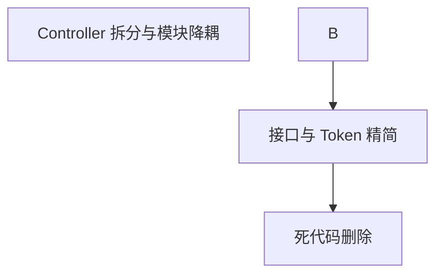

# Symbol Components 职责边界清理计划

> **任务聚焦**: 基于明确的组件职责分工，清理老旧过时代码和职责混淆 | **日期**: 2025-09-21

## 📋 组件职责边界定义

### 1. SymbolMapperService (规则管理器)
- ✅ **专职**: 预制映射规则的 CRUD 操作
- ✅ **职责**: 管理数据源映射配置、处理规则增删改查
- ❌ **禁止**: 不包含任何转换执行逻辑

### 2. SymbolTransformerService (转换执行器)
- ✅ **专职**: 读取规则并执行转换
- ✅ **职责**: transformSymbols(), transformSingleSymbol(), transformSymbolsForProvider()
- ✅ **职责**: 输入验证、格式判断等执行逻辑
- ❌ **禁止**: 不处理规则管理

## 🔍 老旧代码分析结果

### 🚨 **Critical Issue 1: Controller职责混乱**

**问题**: `SymbolMapperController` 同时暴露规则管理与转换执行端点，直接注入执行器服务。

**验证证据**:
```typescript
// src/core/00-prepare/symbol-mapper/controller/symbol-mapper.controller.ts:92-123
@Post("map")
async mapSymbol(@Body() body: { symbol: string; fromProvider: string; toProvider: string }) {
  const mappedSymbol = await this.symbolTransformerService.transformSingleSymbol(
    body.toProvider,
    body.symbol,
    MappingDirection.FROM_STANDARD,
  );
  return {
    originalSymbol: body.symbol,
    mappedSymbol,
    fromProvider: body.fromProvider,
    toProvider: body.toProvider,
  };
}

// src/core/00-prepare/symbol-mapper/controller/symbol-mapper.controller.ts:146-207
@Post("transform")
async transformSymbols(@Body(ValidationPipe) transformDto: TransformSymbolsDto) {
  const result = await this.symbolTransformerService.transformSymbols(
    transformDto.dataSourceName,
    transformDto.symbols,
    MappingDirection.FROM_STANDARD,
  );
  return {
    dataSourceName: result.metadata.provider,
    transformedSymbols: result.mappingDetails,
    failedSymbols: result.failedSymbols,
    processingTimeMs: result.metadata.processingTimeMs,
  };
}
```

**影响分析**:
- 🚨 **职责边界模糊**: 控制器承担了执行器模块的转换职责。
- 🚨 **耦合度升高**: 为了暴露端点，规则管理模块必须跨层依赖执行器模块。
- ⚠️ **测试与演进受限**: 难以针对不同职责拆分测试与部署。

**修复方案**:
- 新建 `SymbolTransformerController`（建议路径：`src/core/02-processing/symbol-transformer/controller/`）。
- 将 `map`、`transform` 端点迁移至新控制器，并通过 `SymbolTransformerModule` 导出。
- 移除 `SymbolMapperController` 中的执行器依赖，仅保留规则管理相关路由。
- 更新 Swagger Tag 与权限注解，确保文档、鉴权描述与新结构一致。

**一次性优化理由**: 当前项目为全新仓库，无历史兼容压力，可直接在保持路由前缀的情况下完成职责分离。

### 🚨 **Critical Issue 2: 模块依赖待整改**

**问题**: `SymbolMapperModule` 为满足控制器依赖而导入 `SymbolTransformerModule`，导致职责边界继续耦合。

**验证证据**:
```typescript
// src/core/00-prepare/symbol-mapper/module/symbol-mapper.module.ts:12-38
import { SymbolTransformerModule } from "../../../02-processing/symbol-transformer/module/symbol-transformer.module";

@Module({
  imports: [
    ...
    SymbolTransformerModule, // 为转换端点提供 Service
  ],
})
export class SymbolMapperModule {}
```

**影响分析**:
- 🚨 **边界模糊**: Mapper 层需对执行器内部变化负责，限制模块自治。
- ⚠️ **扩展成本上升**: 后续执行器新增依赖时必须同步在 Mapper 模块维护。

**修复方案**:
- 随 Critical Issue 1 迁移控制器后，移除 `SymbolMapperModule` 对 `SymbolTransformerModule` 的导入。
- 保持执行器模块自身通过缓存/仓储与 Mapper 层交互，明确依赖方向。
- 更新架构图与 ADR，记录 API 归属变更。

**风险评估**: 仅调整 NestJS 模块 wiring，无需数据库或配置迁移。

### 🗑️ **Issue 3: RetryUtils 死代码**

**问题**: SymbolTransformerService 包含完全未使用的重试机制

**发现的死代码**:
```bash
# 文件: src/core/02-processing/symbol-transformer/utils/retry.utils.ts
# 代码行数: 331行 (最大单文件)
# 使用情况: 0处引用 (完全未被使用)
```

**验证结果**:
```bash
grep -r "import.*retry" src/ --include="*.ts" | grep -v "retry.utils.ts"
# 结果: 其他文件使用的是 @common/constants/semantic/retry-semantics.constants
# 结论: retry.utils.ts 完全是死代码
```

**影响分析**:
- 🗑️ **代码膨胀**: 331 行无引用逻辑，增加认知成本。
- ⚠️ **潜在隐患**: 静态 `circuitBreakers` Map 未提供回收策略，若被复用可能滞留内存。
- 📈 **维护负担**: 复杂的重试/断路器实现与当前需求脱节。

**修复方案**:
- 删除 `retry.utils.ts` 及相关常量引用，保持执行器服务简洁。
- 如未来确需重试能力，按实际调用链设计轻量封装，避免回归全局静态工具。

**验证步骤**:
1. 移除文件后执行 `rg "RetryUtils" src/`，确认无剩余引用。
2. 运行 `bun run build` 与 `bun run test:unit`，验证编译/单测通过。

### 🟢 **Issue 4: 接口/Token 冗余**

**问题**: `ISymbolTransformer` 及配套接口、DI Token 缺乏实际实现或引用，抽象与代码脱节。

**验证证据**:
```typescript
// src/core/02-processing/symbol-transformer/interfaces/symbol-transformer.interface.ts:1-154
export interface ISymbolTransformer { ... }
// 项目中未找到 "implements ISymbolTransformer"

// src/core/02-processing/symbol-transformer/constants/injection-tokens.constants.ts:16-78
export const INJECTION_TOKENS = { ... };
// 多数 Token 未在项目中使用
```

**影响分析**:
- 🧱 **抽象漂移**: 文档化契约与真实实现不一致，造成阅读误导。
- 🧪 **测试准备复杂**: 缺少统一接口，Mock/替身无法复用抽象。

**修复方案**:
- 让 `SymbolTransformerService` 实现 `ISymbolTransformer`，保留必要契约。
- 删除未使用的接口（格式验证器、缓存、配置、工厂等）与对应 DI Token。
- 更新设计文档，说明后续按需新增抽象的准入标准。

**验证步骤**:
1. 实现接口后运行 `bun run lint`，确认类型签名无误。
2. 删除冗余定义后执行 `bun run build`，确保编译通过。

## 🎯 基于职责边界的清理方案

1. **控制层职责拆分**: 新建 `SymbolTransformerController`，迁移转换端点并移除 Mapper 模块的执行器依赖。
2. **接口与 Token 精简**: 保留必要的 `ISymbolTransformer` 契约，删除无引用抽象与 Token。
3. **死代码移除**: 删除 `retry.utils.ts` 及相关常量，确保仓库无冗余重试逻辑。

上述步骤可一次性执行，最终状态即为目标架构，无需过渡策略。

## 📊 清理效果预期

### **代码行数调整估算**
| 清理项目 | 行数变化 (估算) | 文件影响 | 说明 |
|---------|---------------|---------|------|
| Controller 拆分 | ~120 行调整 | 4 | 控制器迁移与模块 wiring 调整 |
| RetryUtils 删除 | -331 行 | 1 | 完全移除无用工具 |
| 接口/Token 精简 | -150 行 | 2 | 保留必要契约，其余清理 |
| **合计** | **≈ -471 行** | **11** | **职责边界明显收敛** |

### **职责边界改善**
| 组件 | 清理前 | 清理后 | 改善点 |
|------|--------|--------|--------|
| SymbolMapperController | 规则 API + 转换 API | 仅规则管理 API | 职责聚焦 |
| SymbolTransformerController | （缺失） | 转换 API | 明确执行器入口 |
| 模块依赖 | Mapper→Transformer（强耦合） | 各自自治，按需依赖缓存 | 依赖方向清晰 |


### **技术债务消除**
- ✅ 移除静态 circuitBreakers 潜在泄漏点。
- ✅ 清理未使用接口与 Token，降低抽象噪声。
- ✅ 控制层职责清晰，后续测试与扩展更简洁。

## 🚀 实施计划（单批次落地）



1. **Controller 拆分与模块降耦**
   - 新建 `SymbolTransformerController` 并迁移转换端点。
   - 移除 Mapper 模块对执行器模块的导入，更新模块依赖图与 Swagger。
2. **接口与 Token 精简**
   - 让 `SymbolTransformerService` 实现 `ISymbolTransformer`。
   - 删除未使用接口与 DI Token，保留最小契约。

3. **死代码删除**
   - 移除 `retry.utils.ts` 及其导入。
   - 执行构建与测试，确认系统稳定。

### **验证清单**
```bash
bun run lint
bun run test:unit
bun run build

rg "RetryUtils" src/
rg "implements ISymbolTransformer" src/core/02-processing/symbol-transformer/services/
```

## 🎯 成功指标

### **量化目标**
- ✅ 净减少约 470 行无价值代码。
- ✅ 关键控制器/服务职责重新对齐。

### **质量目标**
- ✅ 遵循单一职责原则，模块自治。
- ✅ 明确依赖方向，防止隐形耦合。
- ✅ 保持构建与测试全绿。

### **架构目标**
- ✅ 明确 SymbolMapper 与 SymbolTransformer 的职责边界。
- ✅ 为后续扩展（如多执行器实现）提供清晰契约。

## ✅ 执行记录（2025-09-21）
- 已新增 `SymbolTransformerController` 并在模块层完成控制器/服务依赖梳理。
- `SymbolMapperController` 移除转换端点，`SymbolMapperModule` 不再依赖执行器模块。
- `SymbolTransformerService` 实现 `ISymbolTransformer`，未使用的接口与 Token 已清理。
- `retry.utils.ts` 已删除，仓库内无残留引用。
- 尝试执行 `bun run lint` 与 `bun run test:unit`，分别因历史配置错误与既有用例失败而终止，需后续集中修复。

---

> **核心价值**: 基于职责边界的集中清理，构建清晰组件架构，压缩无效代码，为长期演进奠定基础。

**制定人**: Codex Review Agent
**日期**: 2025-09-21
**适用**: 全新项目 (无历史包袱)
**预期完成**: 1天内完成所有清理
