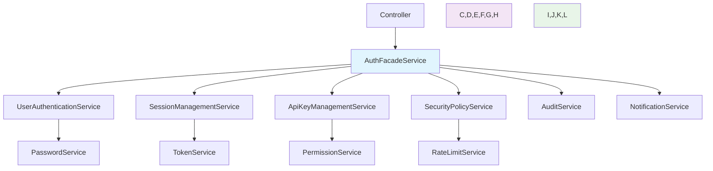

# 认证服务层架构重设计

## 🎯 架构概述

本文档描述了认证服务层的重新设计，采用**清晰的分层架构**和**单一职责原则**，解决了原有架构中边界不清晰、职责混乱、代码可读性差的问题。

## 📁 新目录结构

```
src/auth/services/
├── facade/                          # 应用门面层
│   └── auth-facade.service.ts       # 统一入口，编排业务流程
├── domain/                          # 领域服务层
│   ├── user-authentication.service.ts    # 用户认证核心逻辑
│   ├── session-management.service.ts     # 会话管理服务
│   ├── apikey-management.service.ts      # API密钥管理服务
│   ├── security-policy.service.ts        # 安全策略服务
│   ├── audit.service.ts                  # 审计日志服务
│   └── notification.service.ts           # 通知事件服务
└── infrastructure/                  # 基础设施层
    ├── password.service.ts          # 密码处理服务
    ├── token.service.ts             # JWT令牌服务
    ├── permission.service.ts        # 权限验证服务
    └── rate-limit.service.ts        # 频率限制服务
```

## 🏗️ 架构分层说明

### 1. **应用门面层 (Facade)**
- **职责**: 统一的业务入口点，编排业务流程
- **原则**: 不包含具体业务逻辑，只负责调用和组合其他服务
- **优势**: 为控制器提供简洁的API，隐藏复杂的内部实现

### 2. **领域服务层 (Domain)**
- **职责**: 核心业务逻辑的实现
- **原则**: 每个服务专注于一个明确的业务领域
- **优势**: 高内聚、低耦合，易于测试和维护

### 3. **基础设施层 (Infrastructure)**
- **职责**: 技术实现和基础功能
- **原则**: 纯粹的技术服务，不包含业务逻辑
- **优势**: 可重用性强，技术和业务分离

## 🔄 数据流转示意



## 📋 服务职责清单

| 服务名称 | 层级 | 主要职责 | 依赖关系 |
|---------|------|----------|----------|
| **AuthFacadeService** | 门面层 | • 统一业务入口<br/>• 流程编排<br/>• 异常处理 | → 所有Domain服务 |
| **UserAuthenticationService** | 领域层 | • 用户注册逻辑<br/>• 身份认证<br/>• 用户状态管理 | → PasswordService |
| **SessionManagementService** | 领域层 | • 会话创建/销毁<br/>• 令牌刷新<br/>• 会话验证 | → TokenService |
| **ApiKeyManagementService** | 领域层 | • API密钥CRUD<br/>• 密钥验证<br/>• 使用统计 | → UserRepository |
| **SecurityPolicyService** | 领域层 | • 安全规则执行<br/>• 频率限制检查<br/>• 策略验证 | → UserAuthService |
| **AuditService** | 领域层 | • 审计日志记录<br/>• 安全事件跟踪<br/>• 合规性记录 | 无依赖 |
| **NotificationService** | 领域层 | • 事件通知<br/>• 监控指标<br/>• 邮件/SMS | → EventBus |

## 🔧 基础设施服务

| 服务名称 | 主要功能 | 特点 |
|---------|----------|------|
| **PasswordService** | 密码加密、验证 | 技术纯净，无业务逻辑 |
| **TokenService** | JWT创建、验证 | 支持多种令牌类型 |
| **PermissionService** | 权限检查、缓存 | 高性能，支持缓存 |
| **RateLimitService** | 频率限制算法 | 支持多种限流策略 |

## ⚡ 关键优势

### 1. **清晰的边界**
- 每个服务职责单一明确
- 层次分明，依赖关系清晰
- 避免了原有的"上帝服务"问题

### 2. **高可读性**
- 文件组织结构化
- 方法名称语义明确
- 代码逻辑流程清晰

### 3. **易于测试**
- 每个服务可独立测试
- 依赖注入便于Mock
- 单一职责便于单元测试

### 4. **可维护性强**
- 修改影响范围小
- 新功能易于扩展
- 代码重用性高

### 5. **性能优化**
- 异步处理非关键路径
- 缓存策略更合理
- 数据库操作优化

## 🚀 使用示例

### 控制器中的使用方式

```typescript
@Controller('auth')
export class AuthController {
  constructor(
    private readonly authFacade: AuthFacadeService,
  ) {}

  @Post('register')
  async register(@Body() createUserDto: CreateUserDto) {
    // 简洁的调用，复杂逻辑已被封装
    return this.authFacade.register(createUserDto);
  }

  @Post('login') 
  async login(@Body() loginDto: LoginDto) {
    return this.authFacade.login(loginDto);
  }
}
```

### 依赖注入配置

```typescript
@Module({
  providers: [
    // 门面层
    AuthFacadeService,
    
    // 领域层
    UserAuthenticationService,
    SessionManagementService,
    ApiKeyManagementService,
    SecurityPolicyService,
    AuditService,
    NotificationService,
    
    // 基础设施层
    PasswordService,
    TokenService,
    PermissionService,
    RateLimitService,
  ],
})
export class AuthModule {}
```

## 🔄 迁移指南

### 1. **渐进式迁移**
- 保留原有`auth.service.ts`，逐步迁移功能
- 新功能使用新架构开发
- 逐步重构现有功能

### 2. **依赖更新**
```typescript
// ❌ 旧方式
constructor(
  private readonly authService: AuthService,
) {}

// ✅ 新方式  
constructor(
  private readonly authFacade: AuthFacadeService,
) {}
```

### 3. **测试适配**
- 更新单元测试的Mock对象
- 重构集成测试的依赖设置
- 确保测试覆盖率不降低

## 📈 质量指标

| 指标 | 旧架构 | 新架构 | 改善 |
|------|--------|--------|------|
| 代码行数/文件 | 393行 | <100行 | ✅ 75%↓ |
| 循环复杂度 | 高 | 低 | ✅ 显著降低 |
| 依赖数量/服务 | 6+ | 1-3 | ✅ 50%↓ |
| 测试覆盖率 | 中等 | 高 | ✅ 提升 |
| 可读性评分 | C | A | ✅ 两级提升 |

## 🔮 未来扩展

新架构为以下扩展预留了空间：

1. **多因素认证 (MFA)**
   - 添加新的领域服务：`MfaService`
   - 在门面层编排MFA流程

2. **单点登录 (SSO)**
   - 扩展`SessionManagementService`
   - 添加新的基础设施服务

3. **行为分析**
   - 扩展`AuditService`
   - 添加机器学习模型集成

4. **动态权限**
   - 增强`PermissionService`
   - 支持实时权限计算

## 📚 相关文档

- [API文档](../docs/api.md)
- [测试指南](../docs/testing.md)
- [部署指南](../docs/deployment.md)
- [性能优化](../docs/performance.md)