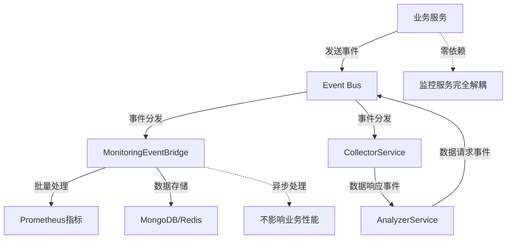

# 📊 监控组件事件化接入指南 

> **🔥 核心理念**：完全基于事件驱动，实现业务逻辑与监控的彻底解耦

## ⚡ 1分钟事件化接入

### Step 1: 模块导入
```typescript
// app.module.ts
import { MonitoringModule } from './monitoring/monitoring.module';

@Module({
  imports: [MonitoringModule], // 自动启用事件驱动监控架构
})
export class AppModule {}
```

### Step 2: 全局拦截器（零配置API监控）
```typescript
// main.ts
import { NestFactory } from '@nestjs/core';
import { ApiMonitoringInterceptor } from './monitoring/infrastructure/interceptors/api-monitoring.interceptor';

const app = await NestFactory.create(AppModule);
const apiMonitoringInterceptor = app.get(ApiMonitoringInterceptor);
app.useGlobalInterceptors(apiMonitoringInterceptor); // 全自动API监控
```

### Step 3: 事件化监控（核心推荐 ⭐⭐⭐⭐⭐）
```typescript
// 任意业务服务 - 只需注入EventEmitter2
import { EventEmitter2 } from '@nestjs/event-emitter';
import { SYSTEM_STATUS_EVENTS } from './monitoring/contracts/events/system-status.events';

@Injectable()
export class UserService {
  constructor(private readonly eventBus: EventEmitter2) {} // 零依赖注入
  
  async createUser(userData: CreateUserDto) {
    const startTime = Date.now();
    
    try {
      const result = await this.userRepository.save(userData);
      
      // 🎯 事件化监控：异步、解耦、高性能
      setImmediate(() => {
        this.eventBus.emit(SYSTEM_STATUS_EVENTS.METRIC_COLLECTED, {
          timestamp: new Date(),
          source: 'user_service',
          metricType: 'database',
          metricName: 'user_created',
          metricValue: Date.now() - startTime,
          tags: { 
            operation: 'create',
            status: 'success',
            user_type: userData.type 
          }
        });
      });
      
      return result;
    } catch (error) {
      // 错误监控同样事件化
      setImmediate(() => {
        this.eventBus.emit(SYSTEM_STATUS_EVENTS.METRIC_COLLECTED, {
          timestamp: new Date(),
          source: 'user_service',
          metricType: 'database',
          metricName: 'user_creation_failed',
          metricValue: Date.now() - startTime,
          tags: { 
            operation: 'create', 
            status: 'error',
            error_type: error.name 
          }
        });
      });
      throw error;
    }
  }
}
```

---

## 🚀 推荐接入模式（按优先级）

### 🥇 模式1: 纯事件驱动（最推荐 - 完全解耦）

```typescript
// 🔥 完全事件化的业务监控
@Injectable()
export class PaymentService {
  constructor(private readonly eventBus: EventEmitter2) {} // 只注入事件总线
  
  async processPayment(payment: PaymentDto) {
    const startTime = Date.now();
    
    try {
      // 发送处理开始事件
      this.emitMonitoringEvent('payment_started', {
        amount: payment.amount,
        method: payment.method
      });
      
      const result = await this.paymentGateway.charge(payment);
      
      // 发送成功事件
      this.emitMonitoringEvent('payment_completed', {
        amount: payment.amount,
        method: payment.method,
        duration: Date.now() - startTime,
        provider: 'stripe'
      });
      
      return result;
    } catch (error) {
      // 发送失败事件
      this.emitMonitoringEvent('payment_failed', {
        amount: payment.amount,
        method: payment.method,
        duration: Date.now() - startTime,
        error_type: error.constructor.name
      });
      throw error;
    }
  }
  
  // 🎯 封装事件发送逻辑，保持代码整洁
  private emitMonitoringEvent(metricName: string, data: any) {
    setImmediate(() => {
      this.eventBus.emit(SYSTEM_STATUS_EVENTS.METRIC_COLLECTED, {
        timestamp: new Date(),
        source: 'payment',
        metricType: 'business',
        metricName,
        metricValue: data.amount || data.duration || 1,
        tags: {
          method: data.method,
          provider: data.provider || 'internal',
          status: metricName.includes('failed') ? 'error' : 'success',
          ...data
        }
      });
    });
  }
}
```

### 🥈 模式2: 装饰器增强（基础设施层性能监控）

```typescript
import { PerformanceMonitoring } from './monitoring/infrastructure/decorators/infrastructure-config.decorator';

@Injectable()
export class StockDataService {
  
  // 装饰器主要用于基础设施层的性能监控，而非业务层
  @PerformanceMonitoring({ 
    slowRequestThreshold: 500,
    recordMetrics: true,
    sampleRate: 1.0
  })
  async getStockQuote(symbol: string): Promise<StockQuote> {
    // 纯业务逻辑，性能监控完全透明
    // 注意：此装饰器主要用于基础设施层监控，业务层推荐使用事件驱动方式
    return await this.dataProvider.fetchQuote(symbol);
  }
  
  @PerformanceMonitoring({
    slowRequestThreshold: 1000,
    recordMetrics: true
  })
  async batchUpdateStocks(symbols: string[]): Promise<void> {
    // 装饰器自动记录响应时间和慢查询
    // 注意：此装饰器主要用于基础设施层监控
  }
}
```

### 🥉 模式3: 分析层事件驱动交互

```typescript
// 📊 数据分析服务 - 通过事件驱动方式与收集层交互
@Injectable()
export class DashboardService {
  constructor(
    private readonly eventBus: EventEmitter2,
    private readonly analyzer: AnalyzerService // 分析服务已事件化
  ) {}
  
  async getDashboardData() {
    // 分析服务内部通过事件驱动方式获取数据，API保持不变
    // 实现机制：AnalyzerService通过SYSTEM_STATUS_EVENTS.DATA_REQUEST事件请求数据，
    // CollectorService通过SYSTEM_STATUS_EVENTS.DATA_RESPONSE事件响应数据
    const healthScore = await this.analyzer.getHealthScore();
    const performance = await this.analyzer.getPerformanceAnalysis();
    
    // 发送仪表盘访问事件
    this.emitEvent('dashboard_accessed', { 
      health_score: healthScore,
      performance_level: performance.healthScore > 70 ? 'good' : 'warning'
    });
    
    return { healthScore, performance };
  }
  
  private emitEvent(name: string, data: any) {
    setImmediate(() => {
      this.eventBus.emit(SYSTEM_STATUS_EVENTS.METRIC_COLLECTED, {
        timestamp: new Date(),
        source: 'dashboard',
        metricType: 'business',
        metricName: name,
        metricValue: 1,
        tags: data
      });
    });
  }
}
```

### ⚠️ 注意：CollectorService直接注入方式（已不推荐）

```typescript
// ⚠️ 不推荐但仍然可用的模式：直接注入CollectorService
@Injectable()
export class LegacyService {
  constructor(
    private readonly collectorService: CollectorService // 可用但不推荐
  ) {}
  
  // 说明：虽然仍可直接使用CollectorService，但推荐使用事件驱动方式
  // 这样可以更好地解耦业务逻辑与监控逻辑，提高系统的可维护性
}
```

---

## 🎯 为什么选择事件化接入？

### ✅ 事件化架构优势

| 方面 | 事件化接入 | 传统直接注入 |
|-----|-----------|------------|
| **耦合度** | ✅ 零耦合 | ❌ 强耦合 |
| **性能影响** | ✅ 异步处理，零影响 | ❌ 同步调用，可能阻塞 |
| **依赖注入** | ✅ 只需EventEmitter2 | ❌ 需要多个监控服务 |
| **测试友好** | ✅ 可独立测试业务逻辑 | ❌ 需要mock多个监控服务 |
| **扩展性** | ✅ 新增监控无需修改业务代码 | ❌ 需要修改构造函数和业务逻辑 |
| **错误隔离** | ✅ 监控失败不影响业务 | ❌ 监控异常可能影响业务 |
| **分析层解耦** | ✅ 通过事件进行数据交互 | ❌ 直接依赖收集层 |

### 🚀 事件化监控核心原理



---

## 🛠️ 事件化监控最佳实践

### 1. 通用事件发送装饰器

```typescript
// 🎨 自定义监控装饰器
export function EventBasedMonitoring(options: {
  source: string;
  operation: string;
  metricType?: 'business' | 'database' | 'cache';
  includeArgs?: boolean;
}) {
  return function (target: any, propertyName: string, descriptor: PropertyDescriptor) {
    const method = descriptor.value;
    
    descriptor.value = async function (...args: any[]) {
      const startTime = Date.now();
      const eventBus = this.eventBus || this.constructor.eventBus;
      
      try {
        const result = await method.apply(this, args);
        
        // 成功事件
        setImmediate(() => {
          eventBus?.emit(SYSTEM_STATUS_EVENTS.METRIC_COLLECTED, {
            timestamp: new Date(),
            source: options.source,
            metricType: options.metricType || 'business',
            metricName: `${options.operation}_success`,
            metricValue: Date.now() - startTime,
            tags: {
              operation: options.operation,
              status: 'success',
              ...(options.includeArgs && { args: JSON.stringify(args) })
            }
          });
        });
        
        return result;
      } catch (error) {
        // 失败事件
        setImmediate(() => {
          eventBus?.emit(SYSTEM_STATUS_EVENTS.METRIC_COLLECTED, {
            timestamp: new Date(),
            source: options.source,
            metricType: options.metricType || 'business',
            metricName: `${options.operation}_failed`,
            metricValue: Date.now() - startTime,
            tags: {
              operation: options.operation,
              status: 'error',
              error_type: error.constructor.name
            }
          });
        });
        
        throw error;
      }
    };
  };
}

// 💡 使用自定义装饰器
@Injectable()
export class ProductService {
  constructor(private readonly eventBus: EventEmitter2) {}
  
  @EventBasedMonitoring({
    source: 'product_service',
    operation: 'search_products',
    metricType: 'business'
  })
  async searchProducts(query: string): Promise<Product[]> {
    return await this.productRepository.search(query);
  }
}
```

### 3. 批量事件发送优化

```typescript
// 🚀 批量事件发送优化器
@Injectable()
export class BatchEventSender {
  private eventQueue: any[] = [];
  private flushTimer?: NodeJS.Timeout;
  
  constructor(private readonly eventBus: EventEmitter2) {}
  
  // 批量发送事件，减少事件总线压力
  queueEvent(eventData: any) {
    this.eventQueue.push(eventData);
    
    // 队列满或定时触发批量发送
    if (this.eventQueue.length >= 10) {
      this.flushEvents();
    } else if (!this.flushTimer) {
      this.flushTimer = setTimeout(() => this.flushEvents(), 100);
    }
  }
  
  private flushEvents() {
    if (this.eventQueue.length === 0) return;
    
    const events = [...this.eventQueue];
    this.eventQueue = [];
    
    if (this.flushTimer) {
      clearTimeout(this.flushTimer);
      this.flushTimer = undefined;
    }
    
    // 批量发送事件
    setImmediate(() => {
      events.forEach(event => {
        this.eventBus.emit(SYSTEM_STATUS_EVENTS.METRIC_COLLECTED, event);
      });
    });
  }
}
```

---

## 📡 支持的事件类型

监控系统支持多种事件类型，用于不同场景的监控需求：

| 事件类型 | 用途 | 触发时机 |
|---------|------|---------|
| `SYSTEM_STATUS_EVENTS.METRIC_COLLECTED` | 通用指标收集 | 业务操作完成时 |
| `SYSTEM_STATUS_EVENTS.API_REQUEST_STARTED` | API请求开始 | HTTP请求到达时 |
| `SYSTEM_STATUS_EVENTS.API_REQUEST_COMPLETED` | API请求完成 | HTTP请求处理完成时 |
| `SYSTEM_STATUS_EVENTS.API_REQUEST_ERROR` | API请求错误 | HTTP请求处理出错时 |
| `SYSTEM_STATUS_EVENTS.CACHE_HIT` | 缓存命中 | 缓存读取成功时 |
| `SYSTEM_STATUS_EVENTS.CACHE_MISS` | 缓存未命中 | 缓存读取失败时 |
| `SYSTEM_STATUS_EVENTS.CACHE_SET` | 缓存设置 | 缓存写入时 |
| `SYSTEM_STATUS_EVENTS.CACHE_INVALIDATED` | 缓存失效 | 缓存被清除时 |
| `SYSTEM_STATUS_EVENTS.DATA_REQUEST` | 数据请求 | 分析层请求数据时 |
| `SYSTEM_STATUS_EVENTS.DATA_RESPONSE` | 数据响应 | 收集层响应数据时 |
| `SYSTEM_STATUS_EVENTS.HEALTH_SCORE_UPDATED` | 健康分更新 | 健康分计算完成时 |

## 🔍 事件化监控调试指南

### 查看事件流

```bash
# 启用事件调试
DEBUG=monitoring:events npm start

# 查看事件统计
curl http://localhost:3000/api/v1/monitoring/events/health

# 检查事件批处理状态
curl http://localhost:3000/api/v1/monitoring/bridge/metrics

# 查看Prometheus指标
curl http://localhost:3000/metrics | grep monitoring_
```

### 事件流程验证

```typescript
// 测试事件发送是否正常
@Injectable()
export class MonitoringTestService {
  constructor(private readonly eventBus: EventEmitter2) {}
  
  testEventFlow() {
    // 发送测试事件
    this.eventBus.emit(SYSTEM_STATUS_EVENTS.METRIC_COLLECTED, {
      timestamp: new Date(),
      source: 'test',
      metricType: 'business',
      metricName: 'test_event',
      metricValue: 1,
      tags: { test: true }
    });
    
    console.log('✅ 测试事件已发送');
  }
}
```

### 常见问题排查

```bash
# 1. 检查EventEmitter2是否正确注入
curl http://localhost:3000/api/v1/monitoring/status

# 2. 查看事件处理错误日志
tail -f logs/monitoring.log | grep "事件处理失败"

# 3. 监控事件队列健康状态
curl http://localhost:3000/api/v1/monitoring/bridge/metrics | jq '.batcher.metrics'

# 4. 验证指标是否正确更新
curl http://localhost:3000/metrics | grep "receiver_requests_total"
```

---

## 📋 事件化接入检查清单

### 🚀 基础接入检查（必需）
- [ ] ✅ 已在 `app.module.ts` 中导入 `MonitoringModule`
- [ ] ✅ 已在 `main.ts` 中注册 `ApiMonitoringInterceptor`
- [ ] ✅ 业务服务中只注入 `EventEmitter2`，不直接注入监控服务
- [ ] ✅ 使用 `setImmediate()` 异步发送监控事件
- [ ] ✅ 事件数据包含完整的 `timestamp`, `source`, `metricType` 等字段

### 📊 事件规范检查（推荐）
- [ ] ✅ 事件标签使用低基数设计（每个标签 < 20个不同值）
- [ ] ✅ 统一使用 `SYSTEM_STATUS_EVENTS.METRIC_COLLECTED` 事件类型
- [ ] ✅ `metricValue` 字段包含有意义的数值（时长、数量、状态等）
- [ ] ✅ `source` 字段明确标识事件来源服务
- [ ] ✅ 错误情况下也发送监控事件

### 🔧 性能优化检查（高级）
- [ ] ✅ 高频操作使用批量事件发送或装饰器模式
- [ ] ✅ 事件发送失败不影响业务逻辑执行
- [ ] ✅ 监控代码占业务代码比例 < 10%
- [ ] ✅ 配置合适的批处理参数（根据业务负载调整）

### 🚨 运维监控检查（生产必需）
- [ ] ✅ 设置事件队列满告警 (`queue_utilization > 80%`)
- [ ] ✅ 配置事件处理失败告警监控
- [ ] ✅ 建立 Grafana 监控面板展示业务指标
- [ ] ✅ 定期检查监控组件自身健康状态

---

## 🎯 快速故障恢复

```bash
# 🚨 监控完全失效时的恢复步骤

# 1. 检查监控模块状态
curl http://localhost:3000/api/v1/monitoring/status

# 2. 重启事件桥接服务（无需重启应用）
curl -X POST http://localhost:3000/api/v1/monitoring/bridge/restart

# 3. 清理阻塞的事件队列
curl -X POST http://localhost:3000/api/v1/monitoring/bridge/flush

# 4. 验证监控恢复
curl http://localhost:3000/metrics | grep -c "monitoring_"
```

---

*事件化监控接入指南 v2.0 | 专注解耦，专注性能，专注稳定性*

---

## 📊 快速查询 API

```bash
# 获取健康评分
GET /api/v1/monitoring/health/score

# 获取性能报告
GET /api/v1/monitoring/performance

# 获取1小时趋势
GET /api/v1/monitoring/trends/1h

# 获取优化建议  
GET /api/v1/monitoring/suggestions

# 缓存失效
POST /api/v1/monitoring/cache/invalidate

# 系统状态
GET /api/v1/monitoring/status
```

---

## 🔧 关键服务速查

| 服务类 | 路径 | 主要方法 | 用途 |
|-------|-----|----------|------|
| **CollectorService** | `./monitoring/collector/collector.service` | `recordRequest()`, `recordDatabaseOperation()` | 数据收集 |
| **AnalyzerService** | `./monitoring/analyzer/analyzer.service` | `getHealthScore()`, `getPerformanceAnalysis()` | 数据分析 |
| **MonitoringCacheService** | `./monitoring/cache/monitoring-cache.service` | `getOrSetHealthData()`, `healthCheck()` | 监控缓存 |
| **ApiMonitoringInterceptor** | `./monitoring/infrastructure/interceptors/api-monitoring.interceptor` | 全局拦截器 | API自动监控 |

---

## ⚡ 性能优化配置

```bash
# 环境变量快速调优
MONITORING_BATCH_SIZE=100                # 批处理大小
MONITORING_FLUSH_INTERVAL_MS=100        # 刷新间隔
MONITORING_MAX_QUEUE_SIZE=10000         # 最大队列
MONITORING_CACHE_TTL_HEALTH=30          # 健康数据TTL
MONITORING_CACHE_TTL_PERFORMANCE=60     # 性能数据TTL
```

---

## 🚨 故障排除

```bash
# 常见问题检查
curl http://localhost:3000/api/v1/monitoring/status        # 整体状态
curl http://localhost:3000/api/v1/monitoring/cache/health  # 缓存状态  
curl http://localhost:3000/metrics                         # Prometheus指标

# 调试模式
LOG_LEVEL=debug npm start
DEBUG=monitoring:* npm start
```

---

## 📈 关键指标速览

```promql
# API成功率
rate(receiver_requests_total{status!~"4..|5.."}[5m]) / rate(receiver_requests_total[5m])

# 平均响应时间
rate(receiver_processing_duration_seconds_sum[5m]) / rate(receiver_processing_duration_seconds_count[5m])

# 缓存命中率  
rate(storage_cache_efficiency[5m])

# 事件处理性能
rate(monitoring_events_processed_total[5m])
```

---

## 📝 标签使用原则

```typescript
// ✅ 好的标签设计（低基数）
{
  method: 'GET|POST|PUT|DELETE',     // ~4个值
  status: '200|400|500',             // ~10个值  
  provider: 'longport|yahoo',        // ~5个值
  operation: 'get_quote|get_info'    // ~20个值
}

// ❌ 避免高基数标签
{
  user_id: '12345',          // 数万个值 ❌
  request_id: 'req_abc',     // 唯一值 ❌
  timestamp: '1640995200'    // 时间戳 ❌
}
```

---

## 🎯 最佳实践检查清单

- [ ] ✅ 已在 `app.module.ts` 中导入 `MonitoringModule`
- [ ] ✅ 已在 `main.ts` 中注册 `ApiMonitoringInterceptor`
- [ ] ✅ 关键业务流程已添加数据收集埋点
- [ ] ✅ 使用合理的标签基数设计
- [ ] ✅ 异步发送事件，不阻塞主流程
- [ ] ✅ 配置适合业务的批处理参数
- [ ] ✅ 设置监控告警和Grafana面板
- [ ] ✅ 定期检查缓存命中率和健康状态

---

*快速参考卡 v2.0 | 5分钟上手，1分钟解决问题*